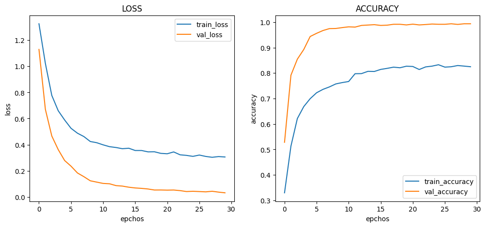
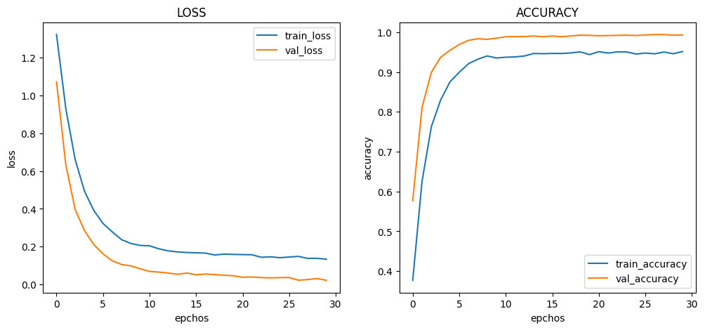
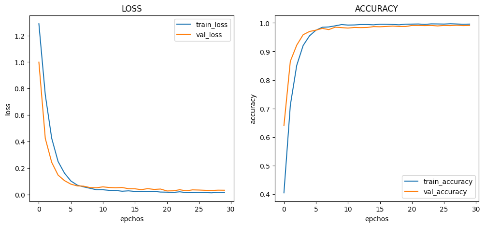
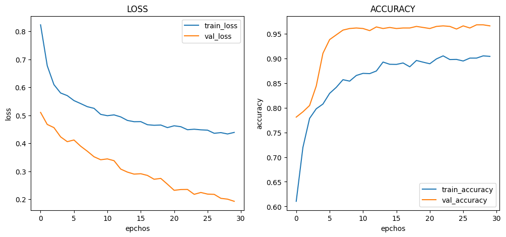
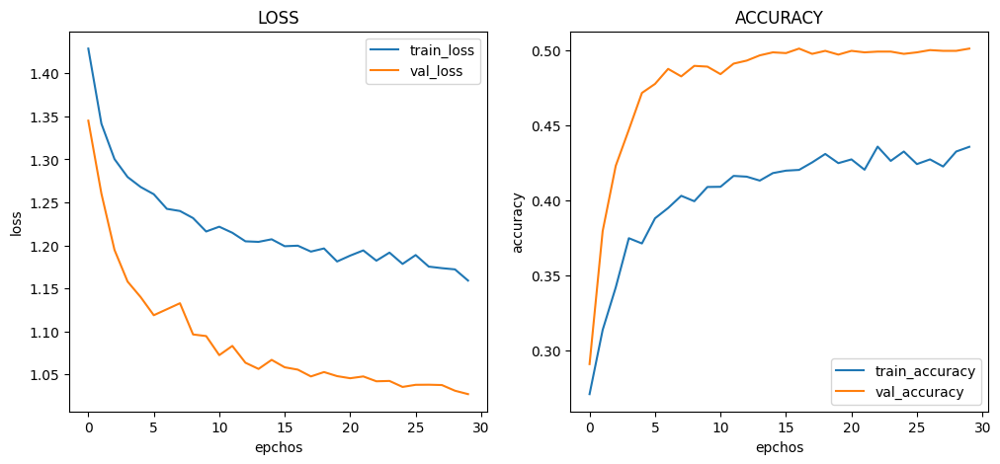

# :pushpin: Kaggle - Blood Cell
- Fine-Tuning the InceptionV3 Model Using the 'Blood Cells' Dataset

 

## 1. 소스코드(Colab)
- [KaggleProject-Blood Cell.ipynb](https://colab.research.google.com/drive/18BXx_fb77k9KbYsv_bVidVf9FhbqK2KA#scrollTo=f2XiUpwDXhNq)

 

## 2. InceptionV3 기본 세팅
- weight: imagenet
- Dropout: 0.5
- optimizer: Adam

 

### 2.1. Basic
- Model Architecture: MobileNet - F - D(8)
- Learning Rate: 1e-5

- Train : [loss: 0.3059, acc: 8248]
- Validation : [loss: 0.0316, val_acc: 0.9935]
- Test : [loss: 0.0309, acc: 0.9944]
- Learning Time :  0:53:20.448415

 

### 2.2. Change dense value to 16
- Model Architecture: MobileNet - F - D(16)
- Learning Rate: 1e-5

- Train : [loss: 0.1335, acc: 0.9514]
- Validation : [loss: 0.0219, val_acc: 0.9930]
- Test : [loss: 0.0227, acc: 0.9948]
- Learning Time : 0:50:05.980897

 

### 2.3. Change dense value to 32
- Model Architecture: MobileNet - F - D(32)
- Learning Rate: 1e-5

- Train : [loss: 0.0145, acc: 0.9959]
- Validation : [loss: 0.0319, val_acc: 0.9910]
- Test : [loss: 0.0239, acc: 0.9944]
- Learning Time : 0:47:13.427400

 

### 2.4. Change the number of hidden layers to 2
- Model Architecture: MobileNet - F - D(8) - D(8)
- Learning Rate: 1e-5

- Train : [loss: 0.9951, acc: 0.5164]
- Validation : [loss: 0.6088, val_acc: 0.9900]
- Test : [loss: 0.6134, acc: 0.9916]
- Learning Time : 0:54:24.468800

 

### 2.5. Change the number of hidden layers to 3
- Model Architecture: MobileNet - F - D(8) - D(8) - D(8)
- Learning Rate: 1e-5

- Train : [loss: 1.1591, acc: 0.4356]
- Validation : [loss: 1.0270, val_acc: 0.5010]
- Test : [loss: 1.0250, acc: 0.5008]
- Learning Time : 0:48:10.646637

 

### 2.6. Change learning rate value to 5e-5
- Model Architecture: MobileNet - F - D(8)
- Learning Rate: 5e-5

- Train : [loss: 0.2926, acc: 0.8252]
- Validation : [loss: 0.0194, val_acc: 0.9970]
- Test : [loss: 0.0071, acc: 0.9984]
- Learning Time : 0:41:58.517229

 

### 2.7. Change learning rate value to 1e-4
- Model Architecture: MobileNet - F - D(8)
- Learning Rate: 1e-4

- Train : [loss: 0.2757, acc: 0.8615]
- Validation : [loss: 0.7322, val_acc: 0.8970]
- Test : [loss: 0.7722, acc: 0.8956]
- Learning Time : 0:41:14.884448

 

## 3. The result of MobileNet fine-tuning

| Model | Hidden Layer | Dense Count | Learning Rate | Accuracy | Learning Time(ms) | 
| :-- | :-: | :-: | :-: | :-: | :-: |
| **mn_resultset1** | 1 | 8 | 1e-5 | 99.44% | 448415 |
|  |  |  |  |  |  |
| **mn_resultset2** | 1 | **16** | 1e-5 | **99.48%** | 980897 |
| **mn_resultset3** | 1 | **32** | 1e-5 | 99.44% | **427400** |
|  |  |  |  |  |  |
| **mn_resultset4** | **2** | 8 | 1e-5 | 99.16% | 468800 |
| **mn_resultset5** | **3** | 8 | 1e-5 | **50.08%** | 646637 |
|  |  |  |  |  |  |
| **mn_resultset6** | 1 | 8 | **5e-5** | 82.52% | 517229 |
| **mn_resultset7** | 1 | 8 | **1e-4** | 89.56% | **884448** |

 

## 4. Reflection

- 히든 레이어와 정확도
	- 실험 결과에 따르면, 히든 레이어의 수가 증가함에 따라 정확도가 증가하는 경향을 관찰하였습니다. 
	- Hidden Layer가 2개인 모델은 다른 모델들보다 정확도가 상대적으로 낮았습니다. 
	- 이는 Hidden Layer의 수가 많아질수록 모델의 복잡성이 증가하고, 적절한 수의 Hidden Layer가 모델의 성능을 향상시킬 수 있음을 시사합니다.

- 덴스 수 증가와 정확도
	- 실험 결과를 분석한 결과, 덴스 수가 증가함에 따라 정확도가 증가하는 경향을 관찰할 수 있었습니다.
	- Dense Count가 16 또는 32인 모델들은 다른 모델들보다 높은 정확도를 보여주었습니다. 
	- 이는 더 많은 노드(뉴런)가 모델에 추가되면 모델이 더 복잡한 패턴을 학습할 수 있으며, 이는 모델의 성능을 향상시킬 수 있음을 나타냅니다.

- 러닝 레이트와 정확도
	- mn_resultset7에서 Learning Rate가 1e-4인 모델은 높은 학습률로 학습되어 상대적으로 높은 정확도를 달성했습니다. 
	- 그러나 mn_resultset6에서 Learning Rate가 5e-5인 모델은 낮은 학습률로 학습되어 정확도가 낮아졌습니다. 
	- 적절한 학습률을 선택하는 것은 모델의 성능을 최적화하는 데 중요합니다.
	
 
