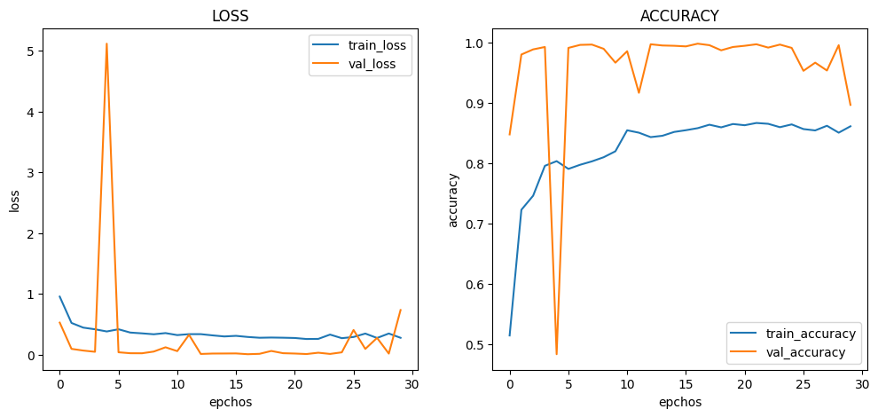

# :pushpin: Kaggle - Blood Cell
- Fine-Tuning the InceptionV3 Model Using the 'Blood Cells' Dataset

 

## 1. 소스코드(Colab)
- [KaggleProject-Blood Cell.ipynb](https://colab.research.google.com/drive/18BXx_fb77k9KbYsv_bVidVf9FhbqK2KA#scrollTo=f2XiUpwDXhNq)

 

## 2. InceptionV3 기본 세팅
- weight: imagenet
- Dropout: 0.5
- optimizer: Adam

 

### 2.1. Basic
- Model Architecture: InceptionV3 - F - D(8)
- Learning Rate: 1e-5

- Train: [loss: 0.3059, acc: 0.8248]
- Validation: [loss: 0.0316, val_acc: 0.9935]
- Test: [loss: 0.0309, acc: 0.9944]
- Learning Time: 0:53:20.448415

 

### 2.2. Change dense value to 16
- Model Architecture: InceptionV3 - F - D(16)
- Learning Rate: 1e-5

- Train: [loss: 0.1335, acc: 0.9514]
- Validation: [loss: 0.0219, val_acc: 0.9930]
- Test: [loss: 0.0227, acc: 0.9948]
- Learning Time: 0:50:05.980897

 

### 2.3. Change dense value to 32
- Model Architecture: InceptionV3 - F - D(32)
- Learning Rate: 1e-5

- Train: [loss: 0.0145, acc: 0.9959]
- Validation: [loss: 0.0319, val_acc: 0.9910]
- Test: [loss: 0.0239, acc: 0.9944]
- Learning Time: 0:47:13.427400

 

### 2.4. Change the number of hidden layers to 2
- Model Architecture: InceptionV3 - F - D(8) - D(8)
- Learning Rate: 1e-5

- Train: [loss: 0.9951, acc: 0.5164]
- Validation: [loss: 0.6088, val_acc: 0.9900]
- Test: [loss: 0.6134, acc: 0.9916]
- Learning Time: 0:54:24.468800

 

### 2.5. Change the number of hidden layers to 3
- Model Architecture: InceptionV3 - F - D(8) - D(8) - D(8)
- Learning Rate: 1e-5

- Train: [loss: 1.1591, acc: 0.4356]
- Validation: [loss: 1.0270, val_acc: 0.5010]
- Test: [loss: 1.0250, acc: 0.5008]
- Learning Time: 0:48:10.646637

 

### 2.6. Change learning rate value to 5e-5
- Model Architecture: InceptionV3 - F - D(8)
- Learning Rate: 5e-5

- Train: [loss: 0.2926, acc: 0.8252]
- Validation: [loss: 0.0194, val_acc: 0.9970]
- Test: [loss: 0.0071, acc: 0.9984]
- Learning Time: 0:41:58.517229

 

### 2.7. Change learning rate value to 1e-4
- Model Architecture: InceptionV3 - F - D(8)
- Learning Rate: 1e-4

- Train: [loss: 0.2757, acc: 0.8615]
- Validation: [loss: 0.7322, val_acc: 0.8970]
- Test: [loss: 0.7722, acc: 0.8956]
- Learning Time: 0:41:14.884448

 

## 3. The result of InceptionV3 fine-tuning

| Model | Hidden Layer | Dense Count | Learning Rate | Accuracy | Learning Time(ms) | 
| :-- | :-: | :-: | :-: | :-: | :-: |
| **mn_resultset1** | 1 | 8 | 1e-5 | 99.44% | 3200044.415 |
|  |  |  |  |  |  |
| **mn_resultset2** | 1 | **16** | 1e-5 | 99.48% | 3005980.897 |
| **mn_resultset3** | 1 | **32** | 1e-5 | 99.00% | 2833427.4 |
|  |  |  |  |  |  |
| **mn_resultset4** | **2** | 8 | 1e-5 | 99.44% | **3264468.8** |
| **mn_resultset5** | **3** | 8 | 1e-5 | **50.08%** | 2890646.637 |
|  |  |  |  |  |  |
| **mn_resultset6** | 1 | 8 | **5e-5** | **99.84%** | 2518517.229 |
| **mn_resultset7** | 1 | 8 | **1e-4** | 89.56% | **2474884.448** |

 

## 6. 회고 / 느낀점
>Hidden Layer: 
	- Hidden Layer가 증가할 수록 성능이 감소하는 경향성을 확인 할 수 있습니다.
	- Hidden Layer를 2개로 설정한 mn_resultset4도 정확도가 높으며, Hidden Layer를 추가함으로써 모델의 표현력이 향상되었을 가능성이 있습니다. 
	- 그러나 Hidden Layer를 3개로 설정한 mn_resultset5는 낮은 정확도를 보여줍니다. 
	- Hidden Layer의 수를 증가시킬 때에는 적절한 균형을 유지해야 하며, 과적합의 가능성을 고려해야 합니다. 
>Dense Count: 
	- Dense Count의 증가에 따른 경향성을 파악 할 수 없었습니다.
	- mn_resultset2와 mn_resultset3에서 Dense Count를 16과 32로 증가시킨 경우에는 정확도가 유지되거나 감소하는 것을 볼 수 있습니다. 
	- 이는 Dense Count가 증가함에 따라 모델의 복잡성이 증가하면서 과적합이 발생할 가능성이 높아진 것으로 해석할 수 있습니다. 
>Learning Rate: 
	- Learning Rate의 증가에 따른 경향성을 파악 할 수 없었습니다.
	- Learning Rate를 5e-5로 설정한 mn_resultset6은 더 높은 정확도를 보여주며, 적절한 학습 속도를 선택함으로써 모델의 성능을 개선한 것으로 보입니다. 
	- 그러나 Learning Rate를 1e-4로 설정한 mn_resultset7에서 정확도가 감소하는 것을 볼 수 있습니다. 
	- 너무 큰 학습률은 모델의 학습 과정을 불안정하게 만들 수 있으므로 주의가 필요합니다. 
>Conculusion: 
	- mn_resultset6의 Hidden Layer를 1개, Dense Count를 8로 설정하고 Learning Rate를 5e-5로 설정한 경우가 가장 높은 정확도를 보였습니다. 

 
