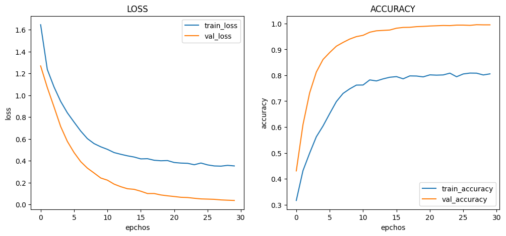
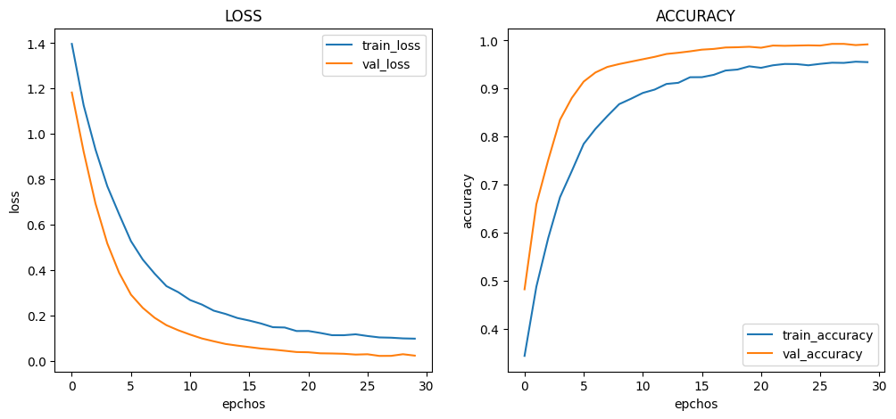
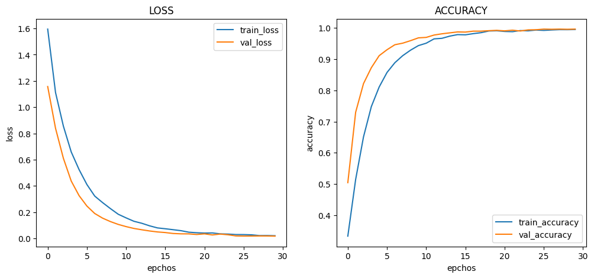
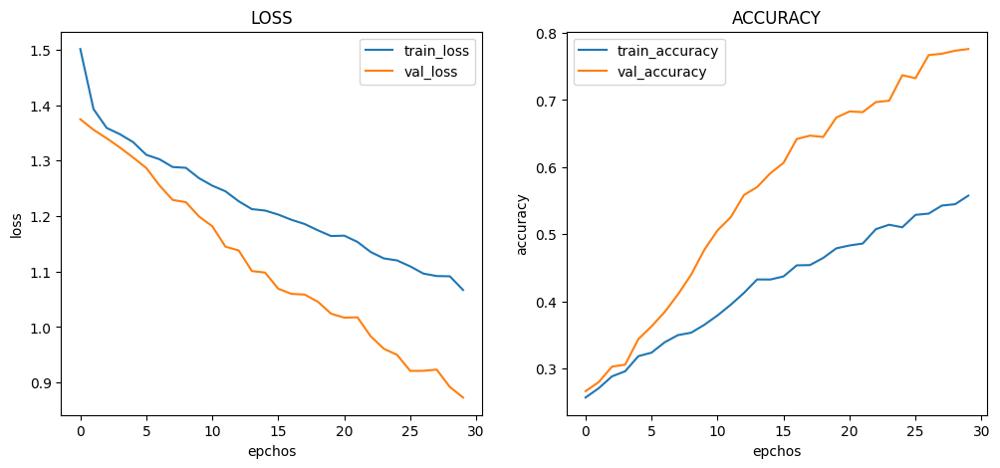
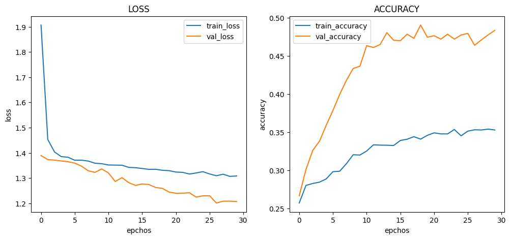
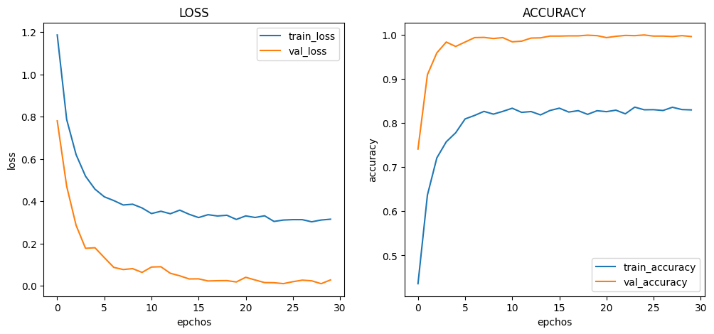
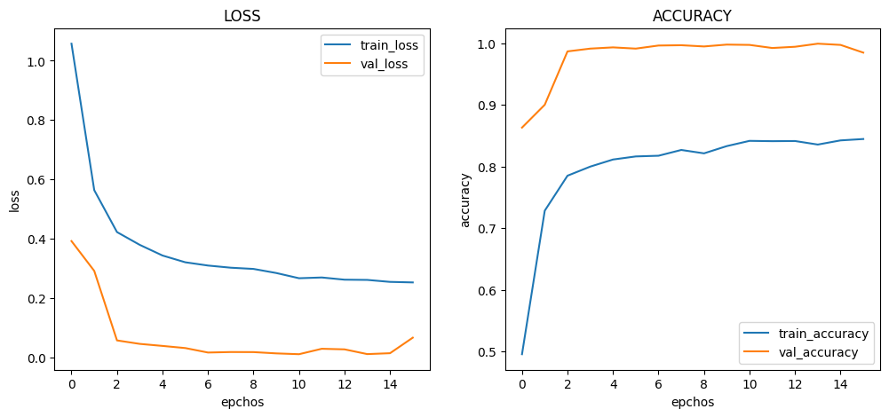
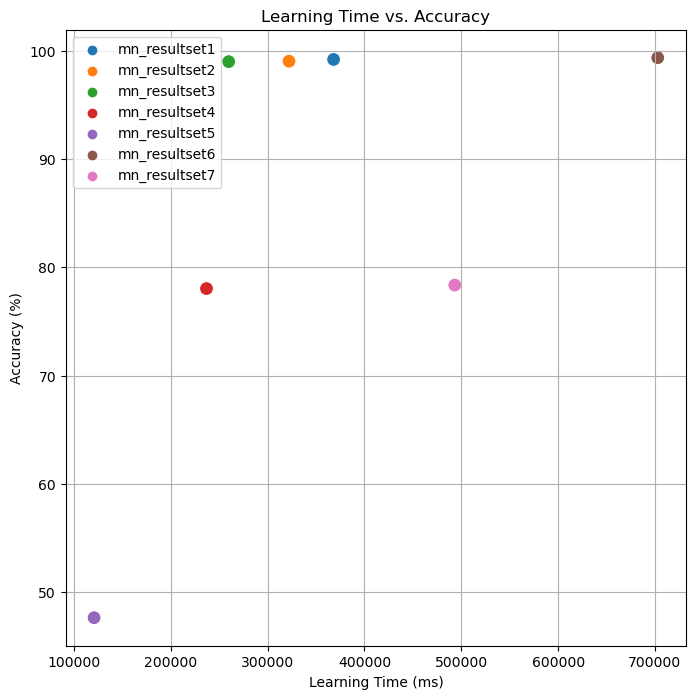

# :pushpin: Kaggle - Blood Cell
- Fine-Tuning the MobileNet Model Using the 'Blood Cells' Dataset

 

## 1. 소스코드(Colab)
- [KaggleProject-Blood Cell.ipynb](https://colab.research.google.com/drive/18BXx_fb77k9KbYsv_bVidVf9FhbqK2KA#scrollTo=f2XiUpwDXhNq)

 

## 2. MobileNet 기본 세팅
- weight: imagenet
- Dropout: 0.5
- optimizer: Adam

 

### 2.1. Basic
- Model Architecture: MobileNet - F - D(8)
- Learning Rate: 1e-5

- Train : [loss: 0.3532, acc: 080559239]
- Validation : [loss: 0.0372, val_acc: 0.9950]
- Test : [loss: 0.0428 - acc: 0.9920]
- Learning Time :  0:20:39.368073

 

### 2.2. Change dense value to 16
- Model Architecture: MobileNet - F - D(16)
- Learning Rate: 1e-5

- Train : [loss: 0.0974, acc: 0.9550]
- Validation : [loss: 0.0225, val_acc: 0.9920]
- Test : [loss: 0.0230 - acc: 0.9904]
- Learning Time :  0:19:32.322051

 

### 2.3. Change dense value to 32
- Model Architecture: MobileNet - F - D(32)
- Learning Rate: 1e-5

- Train : [loss: 0.0205, acc: 0.9948]
- Validation : [loss: 0.0174, val_acc: 0.9960]
- Test : [loss: 0.0278 - acc: 0.9900]
- Learning Time :  0:20:48.259764

 

### 2.4. Change the number of hidden layers to 2
- Model Architecture: MobileNet - F - D(8) - D(8)
- Learning Rate: 1e-5

- Train : [loss: 1.0668, acc: 0.5576]
- Validation : [loss: 0.8729, val_acc: 0.7760]
- Test : [loss: 0.8782 - acc: 0.7804]
- Learning Time :  0:20:51.236816

 

### 2.5. Change the number of hidden layers to 3
- Model Architecture: MobileNet - F - D(8) - D(8) - D(8)
- Learning Rate: 1e-5

- Train : [loss: 1.3084, acc: 0.3528]
- Validation : [loss: 0.2070, val_acc: 0.4835]
- Test : [loss: 1.1995 - acc: 0.4764]
- Learning Time :  0:19:52.120732

 

### 2.6. Change learning rate value to 5e-5
- Model Architecture: MobileNet - F - D(8)
- Learning Rate: 5e-5

- Train : [loss: 0.3148, acc: 0.8298]
- Validation : [loss: 0.0276, val_acc: 0.9960]
- Test : [loss: 0.0492 - acc: 0.9936]
- Learning Time :  0:25:30.702825

 

### 2.7. Change learning rate value to 1e-4
- Model Architecture: MobileNet - F - D(8)
- Learning Rate: 1e-4

- Train : [loss: 0.2533, acc: 0.8445]
- Validation : [loss: 0.0672, val_acc: 0.9845]
- Test : [loss: 0.0721 - acc: 0.9836]
- Learning Time :  0:12:19.493237

 

## 3. The result of MobileNet fine-tuning

| Model | Hidden Layer | Dense Count | Learning Rate | Accuracy | Learning Time(ms) | 
| :-- | :-: | :-: | :-: | :-: | :-: |
| **mn_resultset1** | 1 | 8 | 1e-5 | 99.20% | 368073 |
|  |  |  |  |  |  |
| **mn_resultset2** | 1 | **16** | 1e-5 | 99.04% | 322051 |
| **mn_resultset3** | 1 | **32** | 1e-5 | 99.00% | 259764 |
|  |  |  |  |  |  |
| **mn_resultset4** | **2** | 8 | 1e-5 | 78.04% | 236816 |
| **mn_resultset5** | **3** | 8 | 1e-5 | **47.64%** | 120732 |
|  |  |  |  |  |  |
| **mn_resultset6** | 1 | 8 | **5e-5** | **99.36%** | **702825** |
| **mn_resultset7** | 1 | 8 | **1e-4** | 78.36% | **493237** |

 

## 6. 회고 / 느낀점
>Hidden Layer: 
	- Hidden Layer가 증가할 수록 성능이 감소하는 경향성을 확인 할 수 있습니다.
	- mn_resultset4와 mn_resultset5에서 Hidden Layer를 2개 또는 3개로 설정하면서 뉴런 수를 8로 고정했을 때 정확도가 감소하는 것을 확인할 수 있습니다. 
	- 이는 Hidden Layer의 수가 증가함에 따라 모델의 복잡성이 증가하면서 학습에 어려움이 생길 수 있음을 나타냅니다. 
>Dense Count: 
	- Dense Count가 증가할 수록 성능이 감소하는 경향성을 확인 할 수 있습니다.
	- mn_resultset2와 mn_resultset3에서 Dense Count를 16과 32로 증가시킨 경우에는 정확도가 감소하는 것을 볼 수 있습니다.  
	- 이는 Dense Count를 늘릴수록 모델의 복잡성이 증가하면서 과적합이 발생할 가능성이 높아진 것으로 해석할 수 있습니다. 
>Learning Rate: 
	- Learning Rate의 증가에 따른 경향성을 파악 할 수 없었습니다.
	- mn_resultset1과 mn_resultset6에서 Learning Rate를 1e-5와 5e-5로 설정한 경우에는 정확도가 매우 높습니다. 
	- mn_resultset7에서 Learning Rate를 1e-4로 증가시킨 경우에는 정확도가 낮아지는 것을 볼 수 있습니다. 
	- 너무 큰 학습률은 모델이 수렴하지 못하거나 발산할 가능성을 높일 수 있습니다. 
>Conculusion: 
	- mn_resultset6의 Hidden Layer를 1개, Dense Count를 8로 설정하고 Learning Rate를 5e-5로 설정한 경우가 가장 높은 정확도를 보였습니다. 

 
