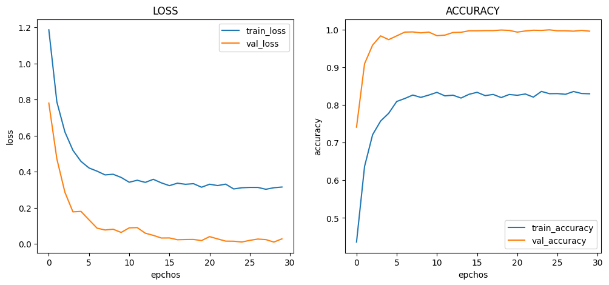
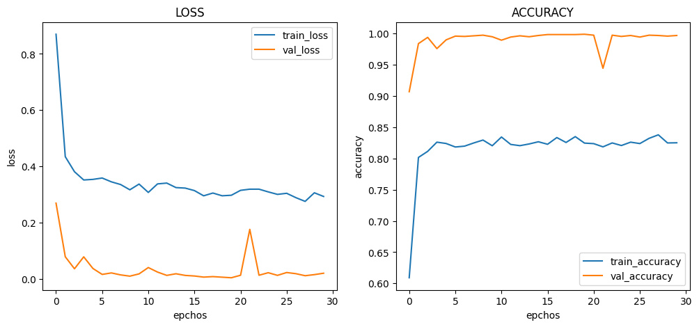
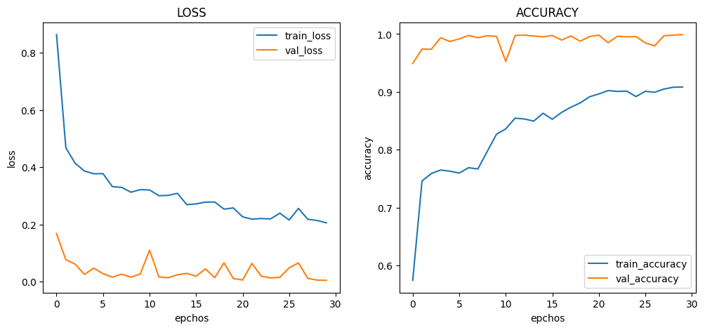
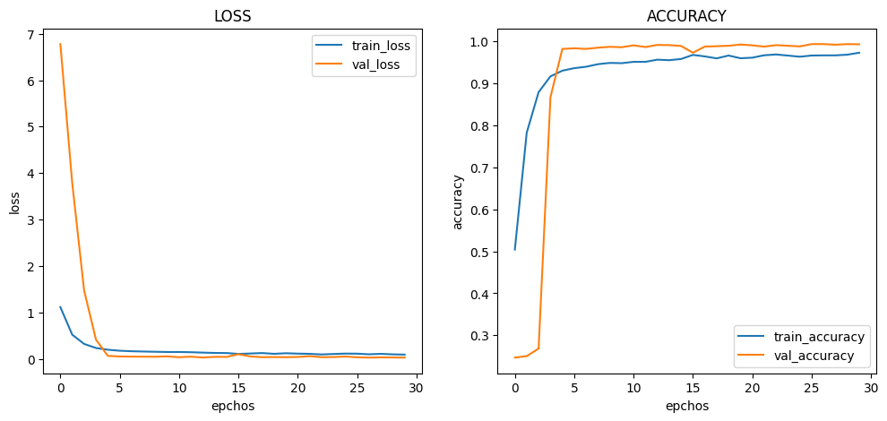
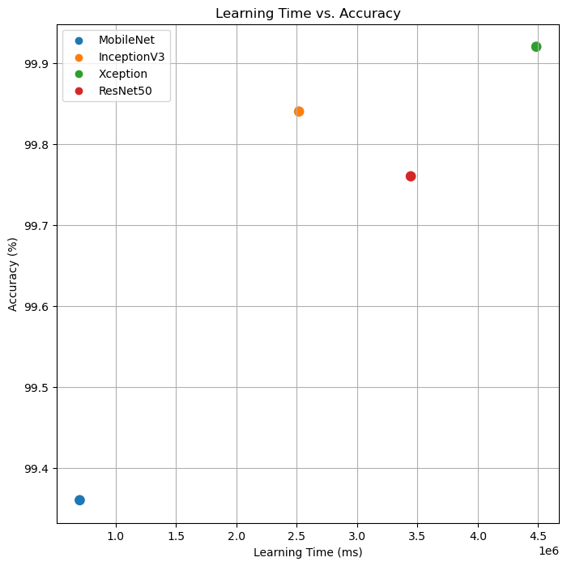

# :pushpin: Kaggle - Blood Cell
- CNN 모델별(MobileNet, InceptionV3, Xception, ResNet50) Blood Cell 데이터 분석 성능 비교

 

## 1. 제작 기간 & 참여 인원
- 2023.00.00 ~ 2023.00.00
- 개인 프로젝트

 

## 2. 사용 라이브러리(Python)
  - 

 

## 3. 소스코드(Colab)
[KaggleProject-Blood Cell.ipynb](https://colab.research.google.com/drive/18BXx_fb77k9KbYsv_bVidVf9FhbqK2KA#scrollTo=f2XiUpwDXhNq)

 

## 4. 모델 비교
- 기본 아키텍처 : pre_trained_model - F - D - D
- weight : imagenet
- 노드 수 : 16
- Dropout : 0.5
- optimizer : Adam(1e-5)

 

### 4.1. MobileNet
- Model Architecture: MobileNet - F - D(8)
- Learning Rate: 5e-5

- Train : [loss: 0.3148, acc: 0.8298]
- Validation : [loss: 0.0276, val_acc: 0.9960]
- Test : [loss: 0.0492 - acc: 0.9936]
- Learning Time :  0:25:30.702825

 

### 4.2. InceptionV3
- Model Architecture: InceptionV3 - F - D(8)
- Learning Rate: 5e-5

- Train: [loss: 0.2926, acc: 0.8252]
- Validation: [loss: 0.0194, val_acc: 0.9970]
- Test: [loss: 0.0071, acc: 0.9984]
- Learning Time: 0:41:58.517229

### 4.3. Xception
- Model Architecture: Xception - F - D(8)
- Learning Rate: 1e-4

- Train: [loss: 0.2061, acc: 0.9083]
- Validation: [loss: 0.0052, val_acc: 0.9990]
- Test: [loss: 0.0068, acc: 0.9992]
- Learning Time: 1:14:44.084134

 

### 4.4. ResNet50
- Model Architecture: ResNet50 - F - D(16)
- Learning Rate: 1e-5

- Train: [loss: 0.0896, acc: 0.9729]
- Validation: [loss: 0.0266, val_acc: 0.9930]
- Test: [loss: 0.0127, acc: 0.9976]
- Learning Time: 0:57:24.579436

 

## 5. 모델 별 학습시간, 정확도 그래프

| Model | Hidden Layer | Dense Count | Learning Rate | Accuracy | Learning Time(ms) | 
| :-- | :-: | :-: | :-: | :-: | :-: |
| **MobileNet** | 1 | 8 | 5e-5 | 99.36% | 702825 |
| **InceptionV3** | 1 | 8 | 5e-5 | 99.84% | 2518517 |
| **Xception** | 1 | 8 | 1e-4 | 99.92% | 4484084 |
| **ResNet50** | 1 | 16 | 1e-5 | 99.76% | 3444579 |

 

## 6. 회고 / 느낀점
-

 
