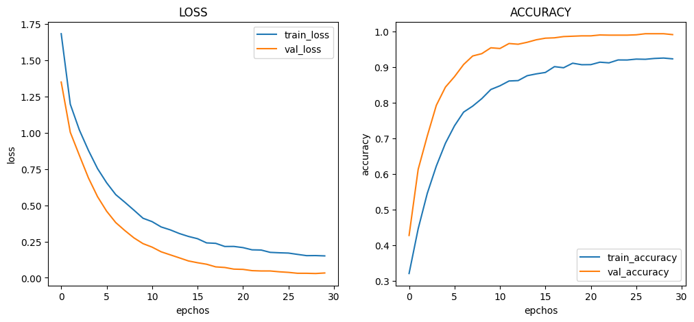
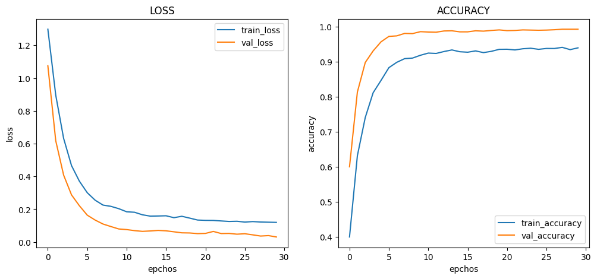
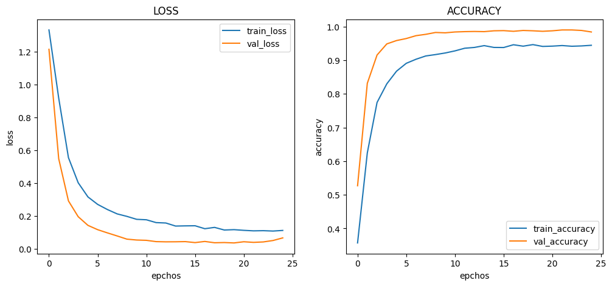
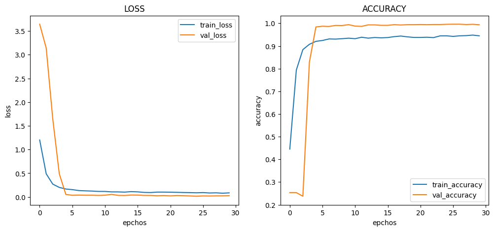
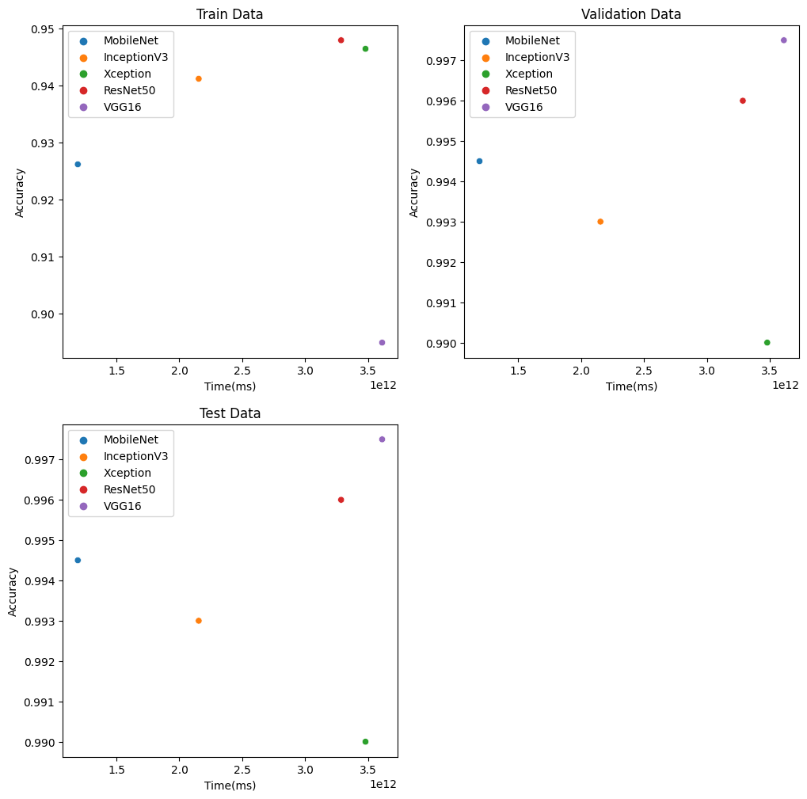

# :pushpin: Kaggle - Blood Cell
- CNN 모델별(MobileNet, InceptionV3, Xception, ResNet50) Blood Cell 데이터 분석 성능 비교

 

## 1. 제작 기간 & 참여 인원
- 2023.00.00 ~ 2023.00.00
- 개인 프로젝트

 

## 2. 사용 라이브러리(Python)
  - 

 

## 3. 소스코드(Colab)
[KaggleProject-Blood Cell.ipynb](https://colab.research.google.com/drive/18BXx_fb77k9KbYsv_bVidVf9FhbqK2KA#scrollTo=f2XiUpwDXhNq)

 

## 4. 모델 별 loss, acc 그래프 확인
- 기본 아키텍처 : pre_trained_model - F - D - D
- weight : imagenet
- 노드 수 : 16
- Dropout : 0.5
- optimizer : Adam(1e-5)

 

### 4.1. MobileNet

- Train : [loss: 0.1509, acc: 0.9239]
- Validation : [loss: 0.0331, val_acc: 0.9920]
- Test : [loss: 0.0236 - acc: 0.9944]
- Learning Time :  0:19:53.549877

 

### 4.2. InceptionV3

- Train : [loss: 0.1198, acc: 0.9398]
- Validation : [loss: 0.0308, val_acc: 0.9930]
- Test : [loss: 0.0127 - acc: 0.9976]
- Learning Time :  0:35:53.756105

### 4.3. Xception

- Train : [loss: 0.1125, acc: 0.9444]
- Validation : [loss: 0.0670, val_acc: 0.9840]
- Test : [loss: 0.0406 - acc: 0.9912]
- Learning Time :  0:57:58.333981

 

### 4.4. ResNet50

- Train : [loss: 0.0862, acc: 0.9448]
- Validation : [loss: 0.0270, val_acc: 0.9935]
- Test : [loss: 0.0145 - acc: 0.9960]
- Learning Time :  0:54:44.536932

 

## 5. 모델 별 학습시간, 정확도 그래프
- x : 학습시간
- y : 정확도
- label : [train, validation, test]

 

## 6. 회고 / 느낀점
-

 
