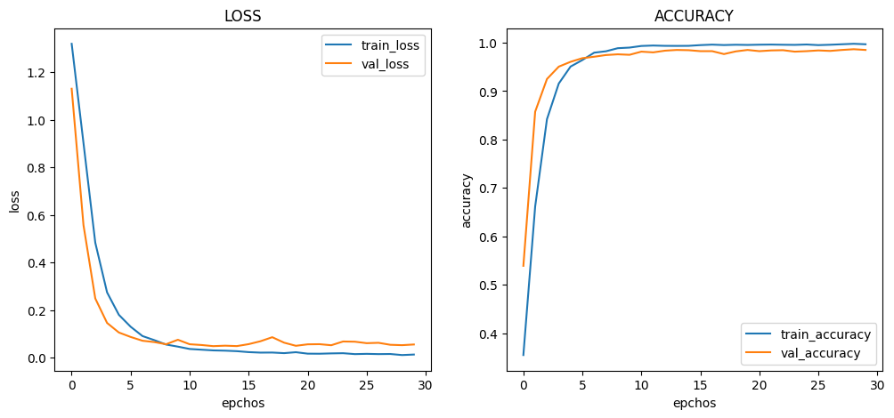

# :pushpin: Kaggle - Blood Cell
- Fine-Tuning the Xception Model Using the 'Blood Cells' Dataset

 

## 1. 소스코드(Colab)
- [KaggleProject-Blood Cell.ipynb](https://colab.research.google.com/drive/18BXx_fb77k9KbYsv_bVidVf9FhbqK2KA#scrollTo=f2XiUpwDXhNq)

 

## 2. Xception 기본 세팅
- weight: imagenet
- Dropout: 0.5
- optimizer: Adam

 

### 2.1. Basic
- Model Architecture: Xception - F - D(8)
- Learning Rate: 1e-5

- Train: [loss: 0.3409, acc: 0.8032]
- Validation: [loss: 0.0331, val_acc: 0.9910]
- Test: [loss: 0.0312, acc: 0.9920]
- Learning Time: 1:19:29.017577

 

### 2.2. Change dense value to 16
- Model Architecture: Xception - F - D(16)
- Learning Rate: 1e-5

- Train: [loss: 0.1011, acc: 0.9550]
- Validation: [loss: 0.0475, val_acc: 0.9880]
- Test: [loss: 0.0216, acc: 0.9932]
- Learning Time: 1:18:20.149439

 

### 2.3. Change dense value to 32
- Model Architecture: Xception - F - D(32)
- Learning Rate: 1e-5

- Train: [loss: 0.0136, acc: 0.9968]
- Validation: [loss: 0.0559, val_acc: 0.9850]
- Test: [loss: 0.0404, acc: 0.9884]
- Learning Time: 1:14:48.856020

 

### 2.4. Change the number of hidden layers to 2
- Model Architecture: Xception - F - D(8) - D(8)
- Learning Rate: 1e-5

- Train: [loss: 0.9441, acc: 0.6242]
- Validation: [loss: 0.6074, val_acc: 0.9690]
- Test: [loss: 0.6097, acc: 0.9700]
- Learning Time: 1:23:35.576984

 

### 2.5. Change the number of hidden layers to 3
- Model Architecture: Xception - F - D(8) - D(8) - D(8)
- Learning Rate: 1e-5

- Train: [loss: 1.1745, acc: 0.4899]
- Validation: [loss: 0.9848, val_acc: 0.9345]
- Test: [loss: 0.9836, acc: 0.9472]
- Learning Time: 1:21:43.406829

 

### 2.6. Change learning rate value to 5e-5
- Model Architecture: Xception - F - D(8)
- Learning Rate: 5e-5

- Train: [loss: 0.2317, acc: 0.8637]
- Validation: [loss: 0.0098, val_acc: 0.9970]
- Test: [loss: 0.0074, acc: 0.9976]
- Learning Time: 1:19:22.879675

 

### 2.7. Change learning rate value to 1e-4
- Model Architecture: Xception - F - D(8)
- Learning Rate: 1e-4

- Train: [loss: 0.2061, acc: 0.9083]
- Validation: [loss: 0.0052, val_acc: 0.9990]
- Test: [loss: 0.0068, acc: 0.9992]
- Learning Time: 1:14:44.084134

 

## 3. The result of Xception fine-tuning

| Model | Hidden Layer | Dense Count | Learning Rate | Accuracy | Learning Time(ms) | 
| :-- | :-: | :-: | :-: | :-: | :-: |
| **mn_resultset1** | 1 | 8 | 1e-5 | 99.20% | 4769017 |
|  |  |  |  |  |  |
| **mn_resultset2** | 1 | **16** | 1e-5 | 99.32% | 4700149 |
| **mn_resultset3** | 1 | **32** | 1e-5 | 98.84% | 4488856 |
|  |  |  |  |  |  |
| **mn_resultset4** | **2** | 8 | 1e-5 | 97.00% | **5015576** |
| **mn_resultset5** | **3** | 8 | 1e-5 | **94.72%** | 4903406 |
|  |  |  |  |  |  |
| **mn_resultset6** | 1 | 8 | **5e-5** | 99.76% | 4762879 |
| **mn_resultset7** | 1 | 8 | **1e-4** | **99.92%** | **4484084** |

 

## 6. 회고 / 느낀점
>Hidden Layer: 
	- Hidden Layer가 증가할 수록 성능이 감소하는 경향성을 확인 할 수 있습니다. 
	- Hidden Layer를 2개로 설정한 mn_resultset4도 정확도가 높지만, 1개의 Hidden Layer로 설정한 모델에 비해 정확도가 낮아진 것을 볼 수 있습니다. 
	- Hidden Layer의 수를 늘릴 경우 모델의 표현력은 향상되지만, 일부 모델은 더 많은 데이터를 필요로 할 수 있습니다. 
	- Hidden Layer를 3개로 설정한 mn_resultset5에서 정확도가 크게 감소한 것을 볼 수 있습니다. 
	- Hidden Layer의 수를 증가시킬 때에는 적절한 균형을 유지해야 하며, 과적합 가능성을 고려해야 합니다. 
>Dense Count: 
	- Dense Count의 증가에 따른 경향성을 파악 할 수 없었습니다. 
	- mn_resultset2에서 Dense Count를 16으로 증가시킨 경우에도 정확도가 높은 수준을 유지하고 있습니다. 
	- 모델의 표현력을 좀 더 높일 수 있었을 것으로 보입니다. 
	- 그러나 mn_resultset3에서 Dense Count를 32로 증가시킨 경우에는 정확도가 낮아지는 것을 볼 수 있습니다. 
	- Dense Count를 너무 크게 설정하면 모델이 복잡한 특징을 학습하는 데 어려움을 겪을 수 있습니다. 
>Learning Rate: 
	- Learning Rate가 증가할수록 정확도가 향상되는 경향성을 확인 할 수 있었습니다. 
	- mn_resultset6과 mn_resultset7에서 Learning Rate를 증가시킨 경우에 높은 정확도를 보여줍니다. 
	- 학습 속도를 조정함으로써 모델의 성능을 개선한 것으로 보입니다. 
>Conculusion:  
	- mn_resultset7의 Hidden Layer를 1개, Dense Count를 8로 설정하고 Learning Rate를 1e-4로 설정한 경우가 가장 높은 정확도를 보였습니다. 

 
