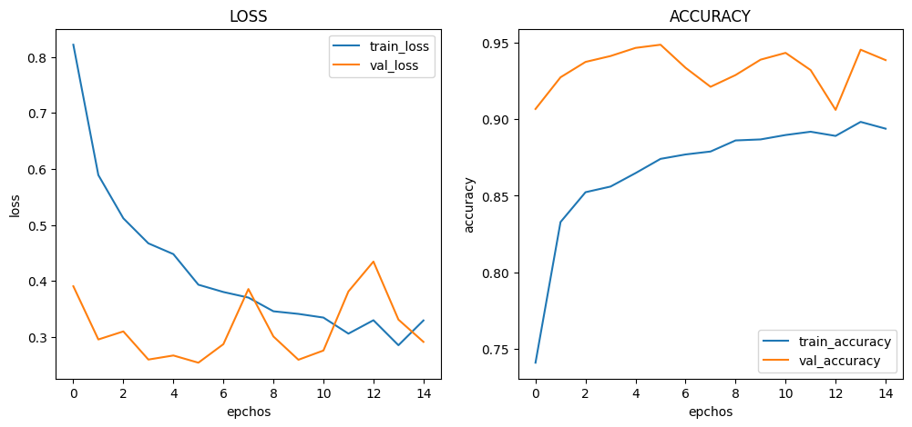

# :pushpin: Kaggle - COVID-19
- Fine-Tuning the InceptionV3 Model Using the 'COVID-19' Dataset

 

## 1. 소스코드(Colab)
- [KaggleProject-COVID-19.ipynb](https://colab.research.google.com/drive/18BXx_fb77k9KbYsv_bVidVf9FhbqK2KA#scrollTo=f2XiUpwDXhNq)

 

## 2. InceptionV3 기본 세팅
- weight: imagenet
- Dropout: 0.5
- optimizer: Adam

 

### 2.1. Basic
- Model Architecture: InceptionV3 - F - D(8)
- Learning Rate: 1e-5

-Train: [loss: 0.3584, acc: 0.8459]
-Validation: [loss: 0.2892, val_acc: 0.9273]
-Test: [loss: 0.2789, acc: 0.9267]
-Learning Time: 0:37:22.135810

 

### 2.2. Change dense value to 16
- Model Architecture: InceptionV3 - F - D(16)
- Learning Rate: 1e-5

-Train: [loss: 0.1171, acc: 0.9491]
-Validation: [loss: 0.3531, val_acc: 0.9247]
-Test: [loss: 0.3588, acc: 0.9286]
-Learning Time: 0:33:52.998940

 

### 2.3. Change dense value to 32
- Model Architecture: InceptionV3 - F - D(32)
- Learning Rate: 1e-5

-Train: [loss: 0.0304, acc: 0.9925]
-Validation: [loss: 0.3265, val_acc: 0.9323]
-Test: [loss: 0.3481, acc: 0.9336]
-Learning Time: 0:32:43.499508

 

### 2.4. Change the number of hidden layers to 2
- Model Architecture: InceptionV3 - F - D(8) - D(8)
- Learning Rate: 1e-5

-Train: [loss: 0.8644, acc: 0.7231]
-Validation: [loss: 0.5290, val_acc: 0.9123]
-Test: [loss: 0.5627, acc: 0.9173]
-Learning Time: 0:42:05.952831

 

### 2.5. Change the number of hidden layers to 3
- Model Architecture: InceptionV3 - F - D(8) - D(8) - D(8)
- Learning Rate: 1e-5

-Train: [loss: 1.1834, acc: 0.5419]
-Validation: [loss: 1.0620, val_acc: 0.8597]
-Test: [loss: 1.0627, acc: 0.8488]
-Learning Time: 0:43:16.059274

 

### 2.6. Change learning rate value to 5e-5
- Model Architecture: InceptionV3 - F - D(8)
- Learning Rate: 5e-5

-Train: [loss: 0.2802, acc: 0.8586]
-Validation: [loss: 0.3454, val_acc: 0.9445]
-Test: [loss: 0.3972, acc: 0.9440]
-Learning Time: 0:32:30.708499

 

### 2.7. Change learning rate value to 1e-4
- Model Architecture: InceptionV3 - F - D(8)
- Learning Rate: 1e-4

-Train: [loss: 0.3295, acc: 0.8938]
-Validation: [loss: 0.2912, val_acc: 0.9386]
-Test: [loss: 0.3809, acc: 0.9334]
-Learning Time: 0:34:04.444849

 

## 3. The result of InceptionV3 fine-tuning

| Model | Hidden Layer | Dense Count | Learning Rate | Accuracy | Learning Time(ms) | 
| :-- | :-: | :-: | :-: | :-: | :-: |
| **mn_resultset1** | 1 | 8 | 1e-5 | 92.67% | 2242135 |
|  |  |  |  |  |  |
| **mn_resultset2** | 1 | **16** | 1e-5 | 92.86% | 2032998 |
| **mn_resultset3** | 1 | **32** | 1e-5 | 93.36% | 1963499 |
|  |  |  |  |  |  |
| **mn_resultset4** | **2** | 8 | 1e-5 | **91.73%** | 2525952 |
| **mn_resultset5** | **3** | 8 | 1e-5 | 91.88% | **2596059** |
|  |  |  |  |  |  |
| **mn_resultset6** | 1 | 8 | **5e-5** | **94.40%** | **1950708** |
| **mn_resultset7** | 1 | 8 | **1e-4** | 93.34% | 2044449 |

 

## 6. 회고 / 느낀점
-

 
