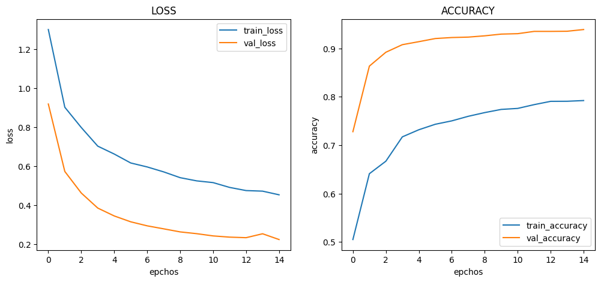
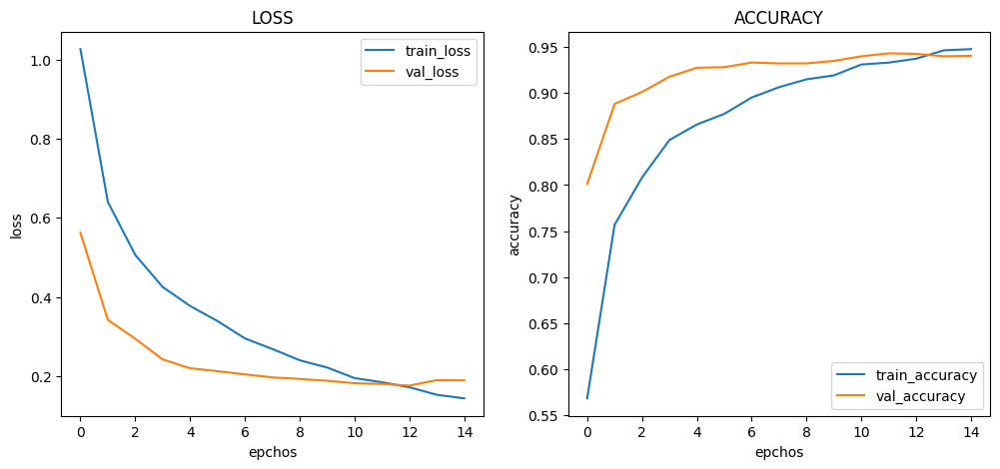
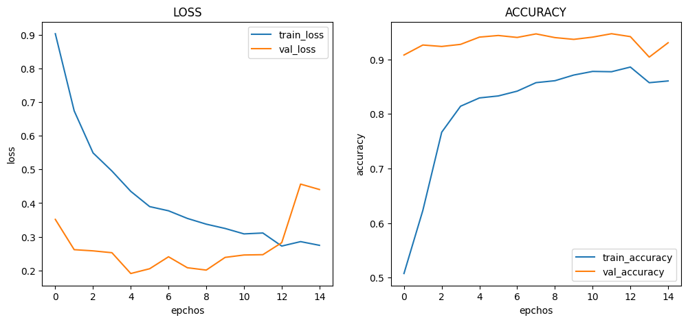

# :pushpin: Kaggle - COVID-19 Radiography
- Fine-Tuning the MobileNet Model Using the 'COVID-19 Radiography' Dataset

 

## 1. 소스코드(Colab)
- [KaggleProject-COVID-19 Radiography.ipynb](https://colab.research.google.com/drive/1L6PIqXr90Z5dmQ6rOFfv8pmAqIsb8Zs5#scrollTo=YYHdRwx4S1Is)

 

## 2. MobileNet 기본 세팅
- weight: imagenet
- Dropout: 0.5
- optimizer: Adam

 

### 2.1. Basic
- Model Architecture: MobileNet - F - D(8)
- Learning Rate: 1e-5

- Train : [loss: 0.3805, acc: 8093]
- Validation : [loss: 0.2370, val_acc: 0.9368]
- Test : [loss: 0.2712 - acc: 0.9327]
- Learning Time :  0:39:53.598426

 

### 2.2. Change dense value to 16
- Model Architecture: MobileNet - F - D(16)
- Learning Rate: 1e-5

- Train : [loss: 0.1321, acc: 0.9460]
- Validation : [loss: 0.2983, val_acc: 0.9394]
- Test : [loss: 0.3346 - acc: 0.9353]
- Learning Time :  0:38:36.385661

 

### 2.3. Change dense value to 32
- Model Architecture: MobileNet - F - D(32)
- Learning Rate: 1e-5

- Train : [loss: 0.0338, acc: 0.9903]
- Validation : [loss: 0.2464, val_acc: 0.9445]
- Test : [loss: 0.2948 - acc: 0.9334]
- Learning Time :  0:35:46.414350

 

### 2.4. Change the number of hidden layers to 2
- Model Architecture: MobileNet - F - D(8) - D(8)
- Learning Rate: 1e-5

- Train : [loss: 0.8738, acc: 0.5483]
- Validation : [loss: 0.6306, val_acc: 0.7693]
- Test : [loss: 0.6331 - acc: 0.7637]
- Learning Time :  0:39:39.260234

 

### 2.5. Change the number of hidden layers to 3
- Model Architecture: MobileNet - F - D(8) - D(8) - D(8)
- Learning Rate: 1e-5

- Train : [loss: 1.0916, acc: 0.5075]
- Validation : [loss: 0.7710, val_acc: 0.6948]
- Test : [loss: 0.7732 - acc: 0.6940]
- Learning Time :  0:36:50.351883

 

### 2.6. Change learning rate value to 5e-5
- Model Architecture: MobileNet - F - D(8)
- Learning Rate: 5e-5

- Train : [loss: 0.2890, acc: 0.8688]
- Validation : [loss: 0.4240, val_acc: 0.9510]
- Test : [loss: 0.5412 - acc: 0.9390]
- Learning Time :  0:34:20.468475

 

### 2.7. Change learning rate value to 1e-4
- Model Architecture: MobileNet - F - D(8)
- Learning Rate: 1e-4

- Train : [loss: 0.2170, acc: 0.8901]
- Validation : [loss: 0.3580, val_acc: 0.9507]
- Test : [loss: 0.4331 - acc: 0.9440]
- Learning Time :  0:33:41.776520

 

## 3. The result of MobileNet fine-tuning

| Model | Hidden Layer | Dense Count | Learning Rate | Accuracy | Learning Time(ms) | 
| :-- | :-: | :-: | :-: | :-: | :-: |
| **mn_resultset1** | 1 | 8 | 1e-5 | 92.79% | 598426 |
|  |  |  |  |  |  |
| **mn_resultset2** | 1 | **16** | 1e-5 | **93.41%** | 385661 |
| **mn_resultset3** | 1 | **32** | 1e-5 | 92.89% | 414350 |
|  |  |  |  |  |  |
| **mn_resultset4** | **2** | 8 | 1e-5 | 76.68% | **260234** |
| **mn_resultset5** | **3** | 8 | 1e-5 | **69.68%** | 351883 |
|  |  |  |  |  |  |
| **mn_resultset6** | 1 | 8 | **5e-5** | 93.31% | 468475 |
| **mn_resultset7** | 1 | 8 | **1e-4** | 93.05% | **776520** |

 

## 6. 회고 / 느낀점
-

 
