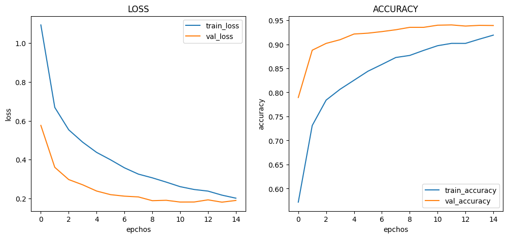
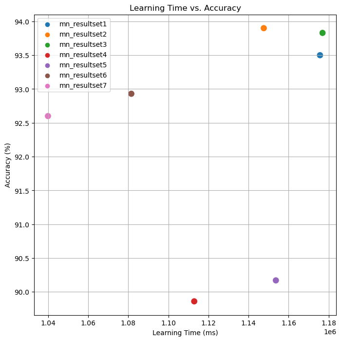

# :pushpin: Kaggle - COVID-19
- Fine-Tuning the MobileNet Model Using the 'COVID-19' Dataset

 

## 1. 소스코드(Colab)
- [KaggleProject-COVID-19.ipynb](https://colab.research.google.com/drive/18BXx_fb77k9KbYsv_bVidVf9FhbqK2KA#scrollTo=f2XiUpwDXhNq)

 

## 2. MobileNet 기본 세팅
- weight: imagenet
- Dropout: 0.5
- optimizer: Adam

 

### 2.1. Basic
- Model Architecture: MobileNet - F - D(8)
- Learning Rate: 1e-5

-Train: [loss: 0.4529, acc: 0.7923]
-Validation: [loss: 0.2231, val_acc: 0.9391]
-Test: [loss: 0.2353, acc: 0.9350]
-Learning Time: 0:19:15.666449

 

### 2.2. Change dense value to 16
- Model Architecture: MobileNet - F - D(16)
- Learning Rate: 1e-5

-Train: [loss: 0.2010, acc: 0.9191]
-Validation: [loss: 0.1893, val_acc: 0.9391]
-Test: [loss: 0.1922, acc: 0.9390]
-Learning Time: 0:19:07.612430

 

### 2.3. Change dense value to 32
- Model Architecture: MobileNet - F - D(32)
- Learning Rate: 1e-5

-Train: [loss: 0.1431, acc: 0.9475]
-Validation: [loss: 0.1888, val_acc: 0.9403]
-Test: [loss: 0.1949, acc: 0.9383]
-Learning Time: 0:19:16.932243

 

### 2.4. Change the number of hidden layers to 2
- Model Architecture: MobileNet - F - D(8) - D(8)
- Learning Rate: 1e-5

-Train: [loss: 1.0404, acc: 0.5298]
-Validation: [loss: 0.7146, val_acc: 0.9019]
-Test: [loss: 0.7014, acc: 0.8986]
-Learning Time: 0:18:32.903349

 

### 2.5. Change the number of hidden layers to 3
- Model Architecture: MobileNet - F - D(8) - D(8) - D(8)
- Learning Rate: 1e-5

-Train: [loss: 1.2018, acc: 0.6381]
-Validation: [loss: 1.0490, val_acc: 0.8945]
-Test: [loss: 1.0459, acc: 0.9017]
-Learning Time: 0:19:13.645992

 

### 2.6. Change learning rate value to 5e-5
- Model Architecture: MobileNet - F - D(8)
- Learning Rate: 5e-5

-Train: [loss: 0.3129, acc: 0.8529]
-Validation: [loss: 0.2870, val_acc: 0.9226]
-Test: [loss: 0.2619, acc: 0.9293]
-Learning Time: 0:18:01.514205

 

### 2.7. Change learning rate value to 1e-4
- Model Architecture: MobileNet - F - D(8)
- Learning Rate: 1e-4

-Train: [loss: 0.2746, acc: 0.8603]
-Validation: [loss: 0.4404, val_acc: 0.9303]
-Test: [loss: 0.4301, acc: 0.9260]
-Learning Time: 0:17:19.916322

 

## 3. The result of MobileNet fine-tuning

| Model | Hidden Layer | Dense Count | Learning Rate | Accuracy | Learning Time(ms) | 
| :-- | :-: | :-: | :-: | :-: | :-: |
| **mn_resultset1** | 1 | 8 | 1e-5 | 93.50% | 1175666 |
|  |  |  |  |  |  |
| **mn_resultset2** | 1 | **16** | 1e-5 | **93.90%** | 1147612 |
| **mn_resultset3** | 1 | **32** | 1e-5 | 93.83% | **1176932** |
|  |  |  |  |  |  |
| **mn_resultset4** | **2** | 8 | 1e-5 | 89.86% | 1112903 |
| **mn_resultset5** | **3** | 8 | 1e-5 | **90.17%** | 1153645 |
|  |  |  |  |  |  |
| **mn_resultset6** | 1 | 8 | **5e-5** | 92.93% | 1081514 |
| **mn_resultset7** | 1 | 8 | **1e-4** | 92.60% | **1039916** |

 

## 6. 회고 / 느낀점
>Hidden Layer: 
	- Hidden Layer의 증가에 따른 경향성을 파악 할 수 없었습니다. 
	- Hidden Layer를 2개로 설정한 mn_resultset4에서는 정확도가 낮아진 것을 볼 수 있습니다. 
	- Hidden Layer를 추가하여 모델의 복잡성을 증가시키는 것이 항상 더 좋은 결과를 가져오는 것은 아니며, 과적합의 가능성도 존재합니다. 
	- Hidden Layer를 3개로 설정한 mn_resultset5에서는 정확도가 증가한 것을 볼 수 있습니다.  
	- Hidden Layer의 수를 늘리면 모델의 표현력이 향상되어 더 복잡한 패턴을 학습할 수 있습니다. 
>Dense Count: 
	- Dense Count의 증가에 따른 경향성을 파악 할 수 없었습니다. 
	- mn_resultset2와 mn_resultset3에서 Dense Count를 16과 32로 증가시킨 경우에는 약간의 정확도 향상이 있습니다. 
	- 모델의 표현력을 증가시키는 데에는 일정한 효과가 있었을 것으로 보입니다. 
>Learning Rate: 
	- Learning Rate의 증가에 따른 경향성을 파악 할 수 없었습니다. 
	- mn_resultset5에서 Learning Rate를 1e-5로 설정한 경우에도 정확도가 유지되고 있습니다.  
	- 적절한 학습 속도를 선택하여 모델의 성능을 개선할 수 있습니다. 
>Conculusion: 
	- mn_resultset2의 Hidden Layer를 1개, Dense Count를 16로 설정하고 Learning Rate를 1e-5로 설정한 경우가 가장 높은 정확도를 보였습니다. 

 
