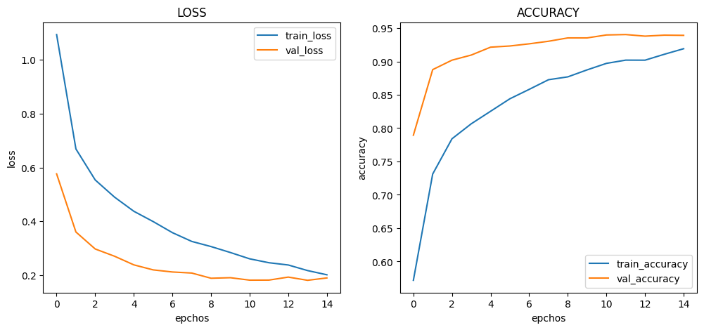
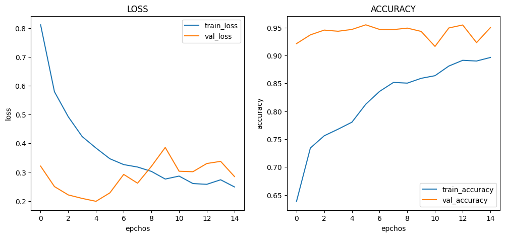
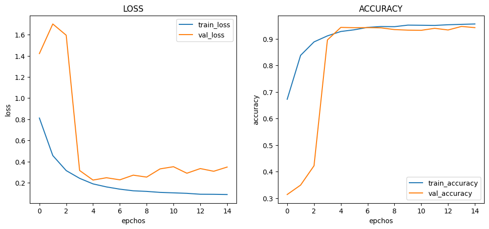
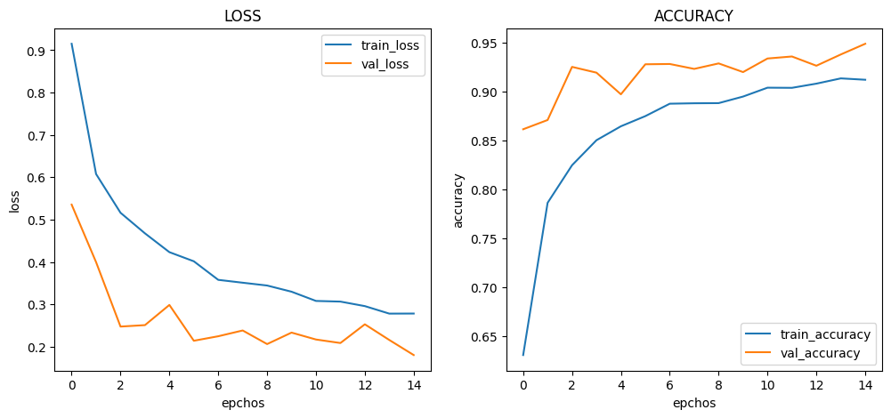
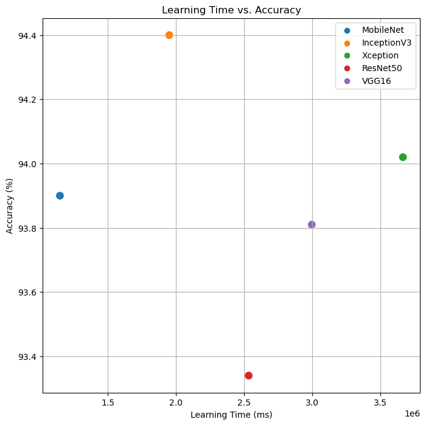

# :pushpin: Kaggle - COVID-19
- CNN 모델별(MobileNet, InceptionV3, Xception, ResNet50) COVID-19 데이터 분석 성능 비교

 

## 1. 제작 기간 & 참여 인원
- 2023.00.00 ~ 2023.00.00
- 개인 프로젝트

 

## 2. 사용 라이브러리(Python)
  - 

 

## 3. 소스코드(Colab)
[KaggleProject-COVID-19.ipynb](https://colab.research.google.com/drive/18BXx_fb77k9KbYsv_bVidVf9FhbqK2KA#scrollTo=f2XiUpwDXhNq)

 

## 4. 모델 비교
- 기본 아키텍처 : pre_trained_model - F - D - D
- weight : imagenet
- 노드 수 : 16
- Dropout : 0.5
- optimizer : Adam(1e-5)

 

### 4.1. MobileNet
- Model Architecture: MobileNet - F - D(16)
- Learning Rate: 1e-5

-Train: [loss: 0.2010, acc: 0.9191]
-Validation: [loss: 0.1893, val_acc: 0.9391]
-Test: [loss: 0.1922, acc: 0.9390]
-Learning Time: 0:19:07.612430

 

### 4.2. InceptionV3
- Model Architecture: InceptionV3 - F - D(8)
- Learning Rate: 5e-5

-Train: [loss: 0.2802, acc: 0.8586]
-Validation: [loss: 0.3454, val_acc: 0.9445]
-Test: [loss: 0.3972, acc: 0.9440]
-Learning Time: 0:32:30.708499

 

### 4.3. Xception
- Model Architecture: Xception - F - D(8)
- Learning Rate: 1e-4

-Train: [loss: 0.2489, acc: 0.8963]
-Validation: [loss: 0.2849, val_acc: 0.9498]
-Test: [loss: 0.3455, acc: 0.9402]
-Learning Time: 1:01:07.383946

 

### 4.4. ResNet50
- Model Architecture: ResNet50 - F - D(16)
- Learning Rate: 1e-5

-Train: [loss: 0.0882, acc: 0.9555]
-Validation: [loss: 0.3478, val_acc: 0.9418]
-Test: [loss: 0.4540, acc: 0.9334]
-Learning Time: 0:42:14.301474

 

### 4.4. VGG16
- Model Architecture: VGG16 - F - D(16)
- Learning Rate: 1e-5

-Train: [loss: 0.1736, acc: 0.9402]
-Validation: [loss: 0.1846, val_acc: 0.9445]
-Test: [loss: 0.2040, acc: 0.9381]
-Learning Time: 0:49:57.433406

 

## 5. 모델 별 학습시간, 정확도 그래프

| Model | Hidden Layer | Dense Count | Learning Rate | Accuracy | Learning Time(ms) | 
| :-- | :-: | :-: | :-: | :-: | :-: |
| **MobileNet** | 1 | 16 | 1e-5 | 93.90% | 1147612 |
| **InceptionV3** | 1 | 8 | 5e-5 | 94.40% | 1950708 |
| **Xception** | 1 | 8 | 1e-4 | 94.02% | 3667383 |
| **ResNet50** | 1 | 16 | 1e-5 | 93.34% | 2534101 |
| **VGG16** | 1 | 16 | 1e-5 | 93.81% | 2997433 |

 

## 6. 회고 / 느낀점
-

 
