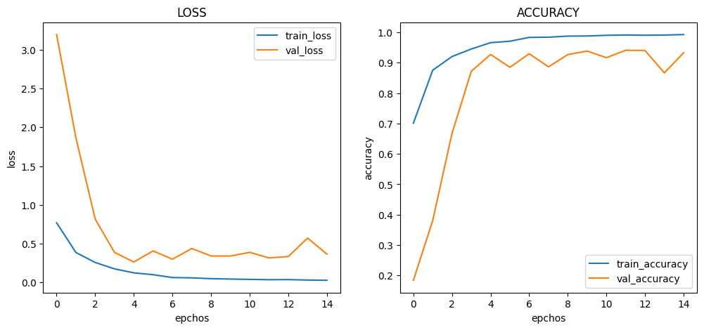
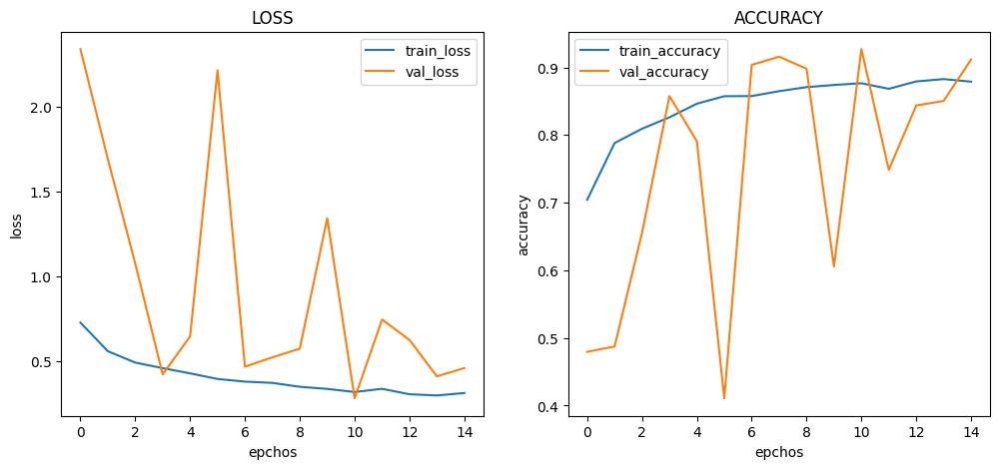

# :pushpin: Kaggle - Blood Cell
- Fine-Tuning the ResNet50 Model Using the 'Blood Cells' Dataset

 

## 1. 소스코드(Colab)
- [KaggleProject-Blood Cell.ipynb](https://colab.research.google.com/drive/18BXx_fb77k9KbYsv_bVidVf9FhbqK2KA#scrollTo=f2XiUpwDXhNq)

 

## 2. ResNet50 기본 세팅
- weight: imagenet
- Dropout: 0.5
- optimizer: Adam

 

### 2.1. Basic
- Model Architecture: ResNet50 - F - D(8)
- Learning Rate: 1e-5

- Train: [loss: 0.4201, acc: 0.8180]
- Validation: [loss: 0.0563, val_acc: 0.9925]
- Test: [loss: 0.0385, acc: 0.9948]
- Learning Time: 1:00:08.099976

 

### 2.2. Change dense value to 16
- Model Architecture: ResNet50 - F - D(16)
- Learning Rate: 1e-5

- Train: [loss: 0.0896, acc: 0.9729]
- Validation: [loss: 0.0266, val_acc: 0.9930]
- Test: [loss: 0.0127, acc: 0.9976]
- Learning Time: 0:57:24.579436

 

### 2.3. Change dense value to 32
- Model Architecture: ResNet50 - F - D(32)
- Learning Rate: 1e-5

- Train: [loss: 0.0110, acc: 0.9966]
- Validation: [loss: 0.0186, val_acc: 0.9975]
- Test: [loss: 0.0203, acc: 0.9952]
- Learning Time: 0:59:01.862169

 

### 2.4. Change the number of hidden layers to 2
- Model Architecture: ResNet50 - F - D(8) - D(8)
- Learning Rate: 1e-5

- Train: [loss: 0.8968, acc: 0.5598]
- Validation: [loss: 0.3956, val_acc: 0.7875]
- Test: [loss: 0.3965, acc: 0.7900]
- Learning Time: 1:00:42.714123

 

### 2.5. Change the number of hidden layers to 3
- Model Architecture: ResNet50 - F - D(8) - D(8) - D(8)
- Learning Rate: 1e-5

- Train: [loss: 1.1404, acc: 0.5053]
- Validation: [loss: 0.9254, val_acc: 0.8970]
- Test: [loss: 0.9224, acc: 0.9056]
- Learning Time: 1:04:22.204818

 

### 2.6. Change learning rate value to 5e-5
- Model Architecture: ResNet50 - F - D(8)
- Learning Rate: 5e-5

- Train: [loss: 0.3715, acc: 0.8345]
- Validation: [loss: 0.0782, val_acc: 0.9885]
- Test: [loss: 0.0533, acc: 0.9896]
- Learning Time: 0:56:14.163438

 

### 2.7. Change learning rate value to 1e-4
- Model Architecture: ResNet50 - F - D(8)
- Learning Rate: 1e-4

- Train: [loss: 0.2687, acc: 0.8556]
- Validation: [loss: 0.0216, val_acc: 0.9945]
- Test: [loss: 0.0298, acc: 0.9928]
- Learning Time: 0:55:34.746021

 

## 3. The result of ResNet50 fine-tuning

| Model | Hidden Layer | Dense Count | Learning Rate | Accuracy | Learning Time(ms) | 
| :-- | :-: | :-: | :-: | :-: | :-: |
| **mn_resultset1** | 1 | 8 | 1e-5 | 99.48% | 3608099 |
|  |  |  |  |  |  |
| **mn_resultset2** | 1 | **16** | 1e-5 | **99.76%** | 3444579 |
| **mn_resultset3** | 1 | **32** | 1e-5 | 99.52% | 3444579 |
|  |  |  |  |  |  |
| **mn_resultset4** | **2** | 8 | 1e-5 | 79.00% | 3642714 |
| **mn_resultset5** | **3** | 8 | 1e-5 | **90.56%** | **3862204** |
|  |  |  |  |  |  |
| **mn_resultset6** | 1 | 8 | **5e-5** | 98.96% | 3374163 |
| **mn_resultset7** | 1 | 8 | **1e-4** | 99.28% | **3334746** |

 

## 6. 회고 / 느낀점
-

 
