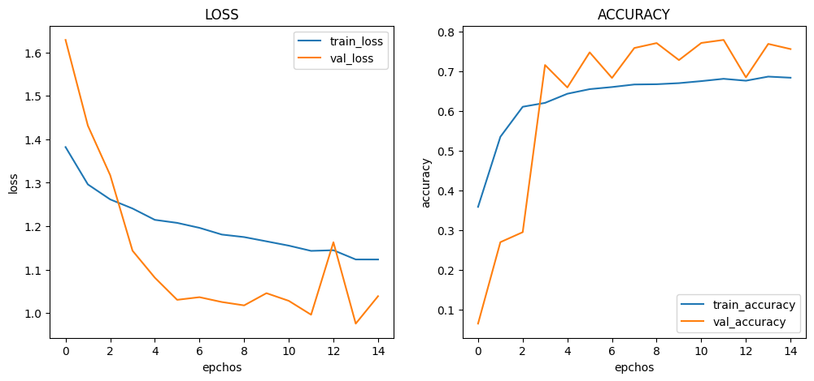

# :pushpin: Kaggle - COVID-19
- Fine-Tuning the ResNet50 Model Using the 'COVID-19' Dataset

 

## 1. 소스코드(Colab)
- [KaggleProject-COVID-19.ipynb](https://colab.research.google.com/drive/18BXx_fb77k9KbYsv_bVidVf9FhbqK2KA#scrollTo=f2XiUpwDXhNq)

 

## 2. ResNet50 기본 세팅
- weight: imagenet
- Dropout: 0.5
- optimizer: Adam

 

### 2.1. Basic
- Model Architecture: ResNet50 - F - D(8)
- Learning Rate: 1e-5

-Train: [loss: 0.3441, acc: 0.8121]
-Validation: [loss: 0.4007, val_acc: 0.9403]
-Test: [loss: 0.5256, acc: 0.9253]
-Learning Time: 0:45:29.432143

 

### 2.2. Change dense value to 16
- Model Architecture: ResNet50 - F - D(16)
- Learning Rate: 1e-5

-Train: [loss: 0.0882, acc: 0.9555]
-Validation: [loss: 0.3478, val_acc: 0.9418]
-Test: [loss: 0.4540, acc: 0.9334]
-Learning Time: 0:42:14.301474

 

### 2.3. Change dense value to 32
- Model Architecture: ResNet50 - F - D(32)
- Learning Rate: 1e-5

-Train: [loss: 0.0272, acc: 0.9928]
-Validation: [loss: 0.3660, val_acc: 0.9329]
-Test: [loss: 0.4626, acc: 0.9258]
-Learning Time: 0:44:05.708914

 

### 2.4. Change the number of hidden layers to 2
- Model Architecture: ResNet50 - F - D(8) - D(8)
- Learning Rate: 1e-5

-Train: [loss: 1.1233, acc: 0.6830]
-Validation: [loss: 1.0388, val_acc: 0.7551]
-Test: [loss: 1.0440, acc: 0.7524]
-Learning Time: 0:47:17.254768

 

### 2.5. Change the number of hidden layers to 3
- Model Architecture: ResNet50 - F - D(8) - D(8) - D(8)
- Learning Rate: 1e-5

-Train: [loss: 1.2397, acc: 0.6118]
-Validation: [loss: 1.1604, val_acc: 0.7734]
-Test: [loss: 1.1571, acc: 0.7710]
-Learning Time: 0:46:38.025818

 

### 2.6. Change learning rate value to 5e-5
- Model Architecture: ResNet50 - F - D(8)
- Learning Rate: 5e-5

-Train: [loss: 0.3109, acc: 0.8789]
-Validation: [loss: 0.4579, val_acc: 0.9117]
-Test: [loss: 0.5590, acc: 0.8993]
-Learning Time: 0:44:10.608853

 

### 2.7. Change learning rate value to 1e-4
- Model Architecture: ResNet50 - F - D(8)
- Learning Rate: 1e-4

-Train: [loss: 0.3109, acc: 0.8789]
-Validation: [loss: 0.4579, val_acc: 0.9117]
-Test: [loss: 0.5590, acc: 0.8993]
-Learning Time: 0:44:10.608853

 

## 3. The result of ResNet50 fine-tuning

| Model | Hidden Layer | Dense Count | Learning Rate | Accuracy | Learning Time(ms) | 
| :-- | :-: | :-: | :-: | :-: | :-: |
| **mn_resultset1** | 1 | 8 | 1e-5 | 92.53% | 2729432 |
|  |  |  |  |  |  |
| **mn_resultset2** | 1 | **16** | 1e-5 | **93.34%** | **2534101** |
| **mn_resultset3** | 1 | **32** | 1e-5 | 92.58% | 2645708 |
|  |  |  |  |  |  |
| **mn_resultset4** | **2** | 8 | 1e-5 | **75.24%** | 2836354 |
| **mn_resultset5** | **3** | 8 | 1e-5 | 77.10% | **2798025** |
|  |  |  |  |  |  |
| **mn_resultset6** | 1 | 8 | **5e-5** | 89.93% | 2660608 |
| **mn_resultset7** | 1 | 8 | **1e-4** | 89.93% | 2660608 |

 

## 6. 회고 / 느낀점
>Hidden Layer: 
	- Hidden Layer의 증가에 따른 경향성을 파악 할 수 없었습니다. 
	- Hidden Layer를 2개로 설정한 mn_resultset4에서는 정확도가 낮아진 것을 볼 수 있습니다. 
	- Hidden Layer를 추가하여 모델의 복잡성을 증가시키는 것이 항상 더 좋은 결과를 가져오는 것은 아니며, 과적합의 가능성도 존재합니다. 
	- Hidden Layer를 3개로 설정한 mn_resultset5에서도 정확도가 낮은 수준을 보여줍니다.  
	- Hidden Layer의 수를 증가시키면 모델이 더 복잡한 패턴을 학습할 수는 있지만, 과적합이 발생하여 성능이 저하될 수 있습니다. 
>Dense Count: 
	- Dense Count의 증가에 따른 경향성을 파악 할 수 없었습니다. 
	- mn_resultset2와 mn_resultset3에서 Dense Count를 16과 32로 증가시킨 경우에는 약간의 정확도 향상이 있습니다.  
	- 증가된 Dense Count로 인해 모델의 표현력이 증가한 것으로 예상됩니다. 
>Learning Rate: 
	- Learning Rate의 증가에 따른 경향성을 파악 할 수 없었습니다. 
	- 적절한 학습 속도를 선택하여 모델의 성능을 개선할 수 있습니다. 
>Conculusion: 
	- mn_resultset2의 Hidden Layer를 1개, Dense Count를 16로 설정하고 Learning Rate를 1e-5로 설정한 경우가 가장 높은 정확도를 보였습니다. 

 
