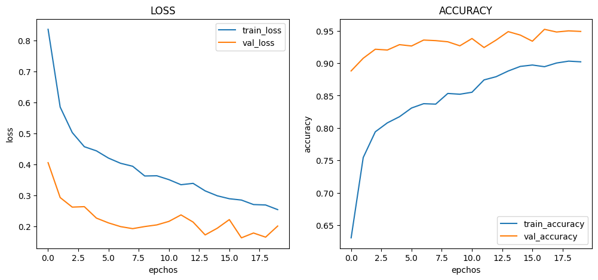
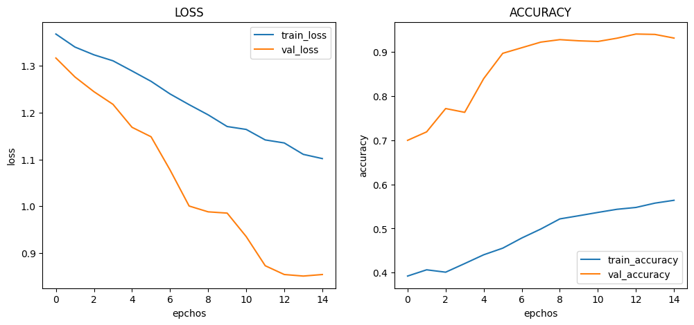
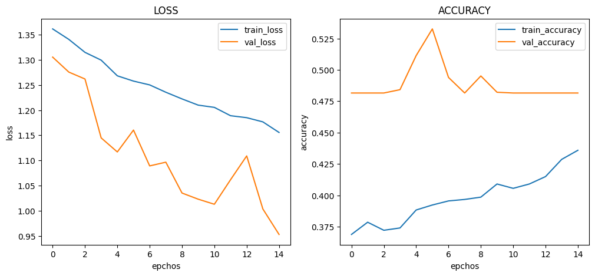

# :pushpin: Kaggle - COVID-19
- Fine-Tuning the VGG16 Model Using the 'COVID-19' Dataset

 

## 1. 소스코드(Colab)
- [KaggleProject-COVID-19.ipynb](https://colab.research.google.com/drive/18BXx_fb77k9KbYsv_bVidVf9FhbqK2KA#scrollTo=f2XiUpwDXhNq)

 

## 2. VGG16 기본 세팅
- weight: imagenet
- Dropout: 0.5
- optimizer: Adam

 

### 2.1. Basic
- Model Architecture: VGG16 - F - D(8)
- Learning Rate: 1e-5

-Train: [loss: 0.5168, acc: 0.7724]
-Validation: [loss: 0.2945, val_acc: 0.9427]
-Test: [loss: 0.3134, acc: 0.9364]
-Learning Time: 0:49:40.271250

 

### 2.2. Change dense value to 16
- Model Architecture: VGG16 - F - D(16)
- Learning Rate: 1e-5

-Train: [loss: 0.1736, acc: 0.9402]
-Validation: [loss: 0.1846, val_acc: 0.9445]
-Test: [loss: 0.2040, acc: 0.9381]
-Learning Time: 0:49:57.433406

 

### 2.3. Change dense value to 32
- Model Architecture: VGG16 - F - D(32)
- Learning Rate: 1e-5

-Train: [loss: 0.1736, acc: 0.9402]
-Validation: [loss: 0.1846, val_acc: 0.9445]
-Test: [loss: 0.2040, acc: 0.9381]
-Learning Time: 0:49:57.433406

 

### 2.4. Change the number of hidden layers to 2
- Model Architecture: VGG16 - F - D(8) - D(8)
- Learning Rate: 1e-5

-Train: [loss: 1.1019, acc: 0.5639]
-Validation: [loss: 0.8545, val_acc: 0.9318]
-Test: [loss: 0.8581, acc: 0.9149]
-Learning Time: 0:49:31.326334

 

### 2.5. Change the number of hidden layers to 3
- Model Architecture: VGG16 - F - D(8) - D(8) - D(8)
- Learning Rate: 1e-5

-Train: [loss: 1.1556, acc: 0.4359]
-Validation: [loss: 0.9527, val_acc: 0.4815]
-Test: [loss: 0.9515, acc: 0.4816]
-Learning Time: 0:48:39.805336

 

### 2.6. Change learning rate value to 5e-5
- Model Architecture: VGG16 - F - D(8)
- Learning Rate: 5e-5

-Train: [loss: 0.5653, acc: 0.8096]
-Validation: [loss: 0.3972, val_acc: 0.9223]
-Test: [loss: 0.3957, acc: 0.9296]
-Learning Time: 0:48:56.834425

 

### 2.7. Change learning rate value to 1e-4
- Model Architecture: VGG16 - F - D(8)
- Learning Rate: 1e-4

-Train: [loss: 0.3950, acc: 0.8124]
-Validation: [loss: 0.2232, val_acc: 0.9312]
-Test: [loss: 0.3957, acc: 0.9296]
-Learning Time: 0:48:56.834425

 

## 3. The result of VGG16 fine-tuning

| Model | Hidden Layer | Dense Count | Learning Rate | Accuracy | Learning Time(ms) | 
| :-- | :-: | :-: | :-: | :-: | :-: |
| **mn_resultset1** | 1 | 8 | 1e-5 | 93.64% | 2980271 |
|  |  |  |  |  |  |
| **mn_resultset2** | 1 | **16** | 1e-5 | **93.81%** | **2997433** |
| **mn_resultset3** | 1 | **32** | 1e-5 | 93.81% | 2997433 |
|  |  |  |  |  |  |
| **mn_resultset4** | **2** | 8 | 1e-5 | 91.49% | 2971326 |
| **mn_resultset5** | **3** | 8 | 1e-5 | **48.16%** | **2915805** |
|  |  |  |  |  |  |
| **mn_resultset6** | 1 | 8 | **5e-5** | 92.96% | 2936834 |
| **mn_resultset7** | 1 | 8 | **1e-4** | 92.96% | 2936834 |

 

## 6. 회고 / 느낀점
>Hidden Layer: 
	- Hidden Layer의 증가에 따라 정확도가 감소하는 경향성을 파악 할 수 없었습니다. 
	- Hidden Layer를 2개로 설정한 mn_resultset4에서는 정확도가 낮아진 것을 볼 수 있습니다. 
	- Hidden Layer를 추가하여 모델의 복잡성을 증가시키는 것이 항상 더 좋은 결과를 가져오는 것은 아니며, 과적합의 가능성도 존재합니다. 
	- Hidden Layer를 3개로 설정한 mn_resultset5에서는 매우 낮은 정확도를 보여줍니다.  
	- Hidden Layer의 수를 증가시키면 모델이 더 복잡한 패턴을 학습할 수는 있지만, 과적합이 발생하여 성능이 저하될 수 있습니다. 
>Dense Count: 
	- Dense Count의 증가에 따른 경향성을 파악 할 수 없었습니다. 
	- mn_resultset2와 mn_resultset3에서 Dense Count를 16과 32로 증가시킨 경우에는 약간의 정확도 향상이 있습니다.  
	- 증가된 Dense Count로 인해 모델의 표현력이 증가한 것으로 예상됩니다. 
>Learning Rate: 
	- Learning Rate의 증가에 따른 경향성을 파악 할 수 없었습니다. 
	- 적절한 학습 속도를 선택하여 모델의 성능을 개선할 수 있습니다. 
>Conculusion: 
	- mn_resultset2의 Hidden Layer를 1개, Dense Count를 16로 설정하고 Learning Rate를 1e-5로 설정한 경우가 가장 높은 정확도를 보였습니다. 

 
