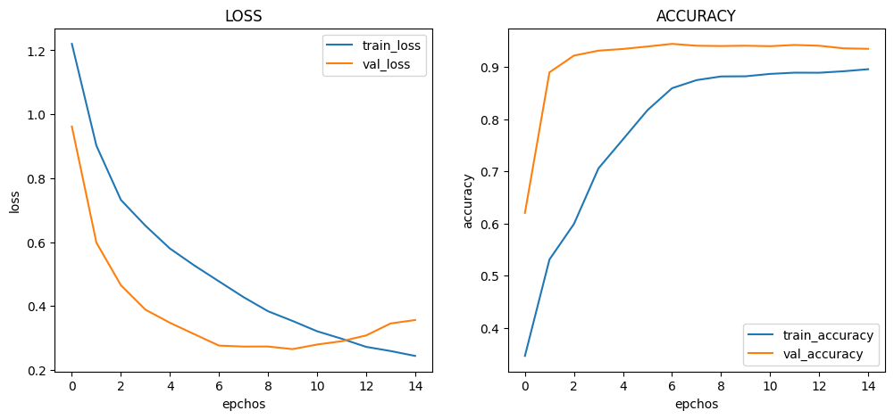
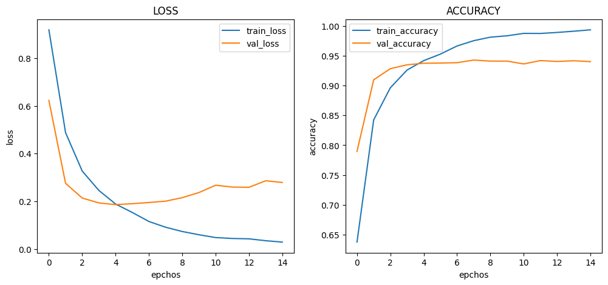
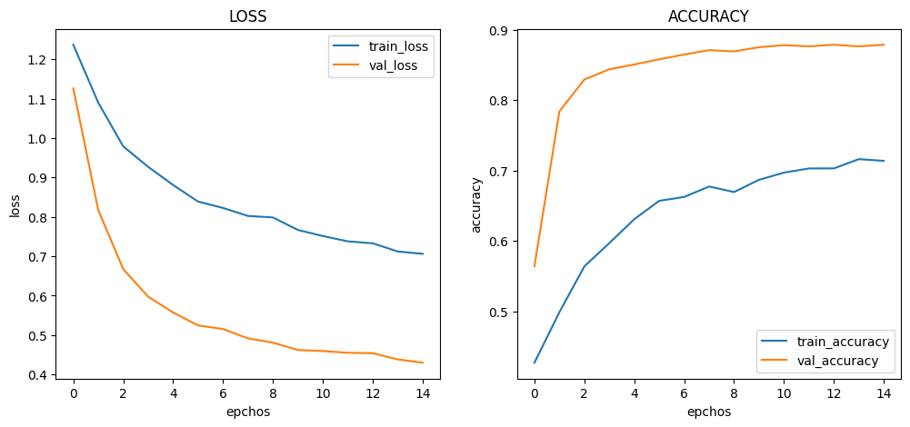
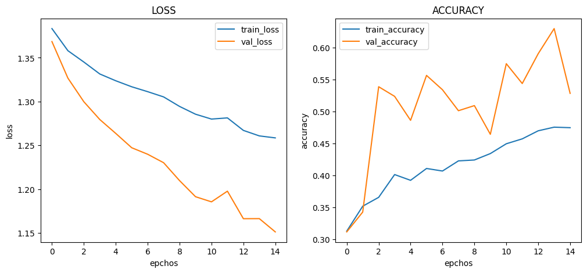
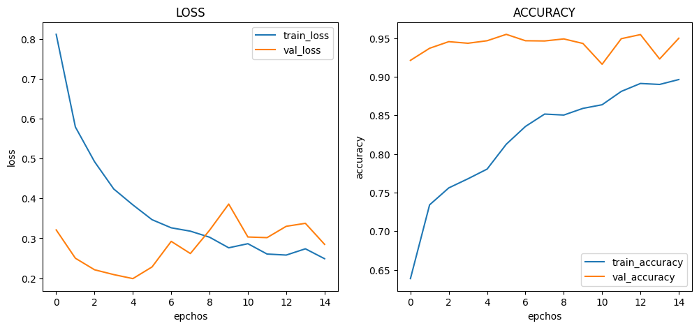
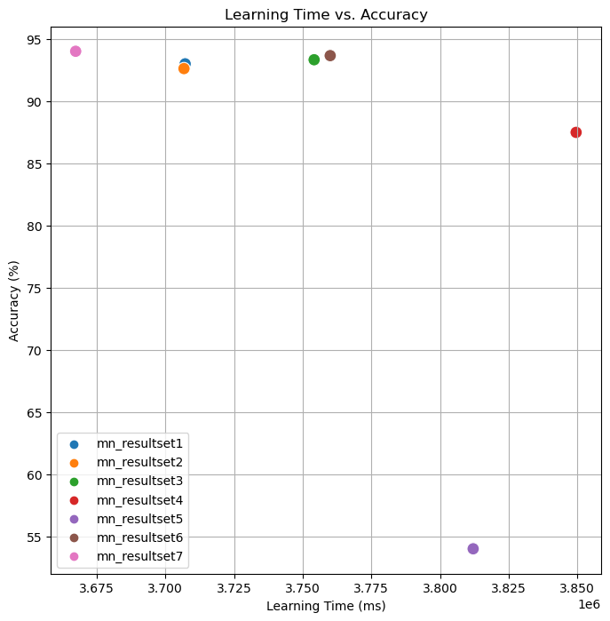

# :pushpin: Kaggle - Blood Cell
- Fine-Tuning the Xception Model Using the 'Blood Cells' Dataset

 

## 1. 소스코드(Colab)
- [KaggleProject-Blood Cell.ipynb](https://colab.research.google.com/drive/18BXx_fb77k9KbYsv_bVidVf9FhbqK2KA#scrollTo=f2XiUpwDXhNq)

 

## 2. Xception 기본 세팅
- weight: imagenet
- Dropout: 0.5
- optimizer: Adam

 

### 2.1. Basic
- Model Architecture: MobileNet - F - D(8)
- Learning Rate: 1e-5

- Train : [loss: 0.3409, acc: 0.8032]
- Validation : [loss: 0.0331, val_acc: 0.9910]
- Test : [loss: 0.0312, acc: 0.9920]
- Learning Time : 1:19:29.017577

 

### 2.2. Change dense value to 16
- Model Architecture: MobileNet - F - D(16)
- Learning Rate: 1e-5

- Train : [loss: 0.1011, acc: 0.9550]
- Validation : [loss: 0.0475, val_acc: 0.9880]
- Test : [loss: 0.0216, acc: 0.9932]
- Learning Time : 1:18:20.149439

 

### 2.3. Change dense value to 32
- Model Architecture: MobileNet - F - D(32)
- Learning Rate: 1e-5

- Train : [loss: 0.0136, acc: 0.9968]
- Validation : [loss: 0.0559, val_acc: 0.9850]
- Test : [loss: 0.0404, acc: 0.9884]
- Learning Time : 1:14:48.856020

 

### 2.4. Change the number of hidden layers to 2
- Model Architecture: MobileNet - F - D(8) - D(8)
- Learning Rate: 1e-5

- Train : [loss: 0.9441, acc: 0.6242]
- Validation : [loss: 0.6074, val_acc: 0.9690]
- Test : [loss: 0.6097, acc: 0.9700]
- Learning Time : 1:23:35.576984

 

### 2.5. Change the number of hidden layers to 3
- Model Architecture: MobileNet - F - D(8) - D(8) - D(8)
- Learning Rate: 1e-5

- Train : [loss: 1.1745, acc: 0.4899]
- Validation : [loss: 0.9848, val_acc: 0.9345]
- Test : [loss: 0.9836, acc: 0.9472]
- Learning Time : 1:21:43.406829

 

### 2.6. Change learning rate value to 5e-5
- Model Architecture: MobileNet - F - D(8)
- Learning Rate: 5e-5

- Train : [loss: 0.2317, acc: 0.8637]
- Validation : [loss: 0.0098, val_acc: 0.9970]
- Test : [loss: 0.0074, acc: 0.9976]
- Learning Time : 1:19:22.879675

 

### 2.7. Change learning rate value to 1e-4
- Model Architecture: MobileNet - F - D(8)
- Learning Rate: 1e-4

- Train : [loss: 0.2757, acc: 0.8615]
- Validation : [loss: 0.7322, val_acc: 0.8970]
- Test : [loss: 0.7722, acc: 0.8956]
- Learning Time : 0:41:14.884448

 

## 3. The result of MobileNet fine-tuning

| Model | Hidden Layer | Dense Count | Learning Rate | Accuracy | Learning Time(ms) | 
| :-- | :-: | :-: | :-: | :-: | :-: |
| **mn_resultset1** | 1 | 8 | 1e-5 | 99.20% | 4769017.577 |
|  |  |  |  |  |  |
| **mn_resultset2** | 1 | **16** | 1e-5 | **99.32%** | 4700149.439 |
| **mn_resultset3** | 1 | **32** | 1e-5 | 98.84% | 4536856.020 |
|  |  |  |  |  |  |
| **mn_resultset4** | **2** | 8 | 1e-5 | 97.00% | **5050576.984** |
| **mn_resultset5** | **3** | 8 | 1e-5 | 94.72% | 4943406.829 |
|  |  |  |  |  |  |
| **mn_resultset6** | 1 | 8 | **5e-5** | 99.76% | 4782879.675 |
| **mn_resultset7** | 1 | 8 | **1e-4** | **89.56%** | **4528084.134** |

 

## 4. Reflection

- 히든 레이어와 정확도
	- 실험 결과에 따르면, 히든 레이어의 수가 증가함에 따라 정확도가 감소하는 경향이 있습니다. 
	- 히든레이어가 2개 또는 3개인 모델들은 다른 모델들보다 상대적으로 낮은 정확도를 보여주었습니다. 
	- 히든레이어의 수가 증가할수록 모델의 복잡성이 증가하고, 적절한 수의 히든레이어가 모델의 성능을 향상시킬 수 있음을 시사합니다.

- 덴스 수 증가와 정확도
	- 실험 결과를 분석한 결과, 덴스 수가 증가함에 따라 정확도가 증가하는 경향을 관찰할 수 있었습니다.
	- 덴스 수가 16인 모델은 다른 모델들보다 높은 정확도를 보여주었습니다. 
	- 그러나 덴스 수가 32인 모델은 높은 정확도를 기록하였으나 덴스 수가 16인 모델보다 낮은 정확도를 보여주었습니다. 
	- 이는 덴스의 수를 증가시키는 것이 항상 모델의 성능을 향상시키는 것은 아니며, 적절한 수준을 찾는 것이 중요하다는 것을 시사합니다.

- 러닝 레이트와 정확도
	- 러닝 레이트가 상대적으로 높을수록 정확도가 낮아지는 경향이 있습니다.
	- 러닝 레이트가 5e-5인 모델은 가장 높은 정확도를 보여주었습니다. 
	- 러닝 레이트가 1e-4인 모델은 상대적으로 낮은 정확도를 기록하였습니다.
	- 적절한 학습률을 선택하는 것이 모델의 성능을 최적화하는 데 중요하다는 것을 시사합니다.
	
- 히든 레이어와 학습시간
	- 실험 결과에 따르면, 히든 레이어의 수가 증가함에 따라 학습시간이 증가하는 경향이 있습니다. 
	- 히든레이어가 2개인 모델은 다른 모델들보다 긴 학습시간을 보여주었습니다. 
	- 그러나 히든레이어의 수가 3개인 모델은 히든레이어 수가 2개인 모델보다 낮은 학습시간을 보여줬습니다.
	- 이는 히든레이어 수를 감소시키는 것이 항상 모델의 학습시간을 감소시키는 것은 아니며, 적절한 수준을 찾는 것이 중요하다는 것을 시사합니다.
	
- 덴스 수 증가와 학습시간
	- 실험 결과에 따르면, 덴스의 수가 증가함에 따라 학습시간이 감소하는 경향이 있습니다. 
	- 덴스 수가 16개 또는 32개인 모델들은 다른 모델들보다 상대적으로 낮은 학습시간을 보여주었습니다. 
	- 이는 덴스의 수가 증가할수록 학습시간을 낮출 수 있음을 시사합니다.

- 러닝 레이트와 학습시간
	- 실험 결과에 따르면, 러닝레이트의 수가 증가함에 따라 학습시간이 감소하는 경향이 있습니다. 
	- 러닝 레이트가 5e-5 또는 1e-4인 모델들은 다른 모델들보다 상대적으로 낮은 학습시간을 보여주었습니다. 
	- 러닝 레이트 수가 증가할수록 학습시간을 낮출 수 있음을 시사합니다.

 
