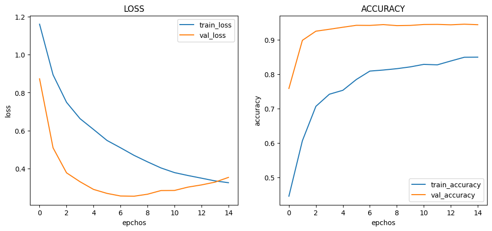

# :pushpin: Kaggle - COVID-19
- Fine-Tuning the Xception Model Using the 'COVID-19' Dataset

 

## 1. 소스코드(Colab)
- [KaggleProject-COVID-19.ipynb](https://colab.research.google.com/drive/18BXx_fb77k9KbYsv_bVidVf9FhbqK2KA#scrollTo=f2XiUpwDXhNq)

 

## 2. Xception 기본 세팅
- weight: imagenet
- Dropout: 0.5
- optimizer: Adam

 

### 2.1. Basic
- Model Architecture: Xception - F - D(8)
- Learning Rate: 1e-5

-Train: [loss: 0.3257, acc: 0.8494]
-Validation: [loss: 0.3536, val_acc: 0.9439]
-Test: [loss: 0.4474, acc: 0.9301]
-Learning Time: 1:01:47.232429

 

### 2.2. Change dense value to 16
- Model Architecture: Xception - F - D(16)
- Learning Rate: 1e-5

-Train: [loss: 0.2441, acc: 0.8961]
-Validation: [loss: 0.3563, val_acc: 0.9353]
-Test: [loss: 0.4365, acc: 0.9263]
-Learning Time: 1:01:46.800844

 

### 2.3. Change dense value to 32
- Model Architecture: Xception - F - D(32)
- Learning Rate: 1e-5

-Train: [loss: 0.0288, acc: 0.9933]
-Validation: [loss: 0.2789, val_acc: 0.9400]
-Test: [loss: 0.3700, acc: 0.9334]
-Learning Time: 1:02:37.174406

 

### 2.4. Change the number of hidden layers to 2
- Model Architecture: Xception - F - D(8) - D(8)
- Learning Rate: 1e-5

-Train: [loss: 0.7063, acc: 0.7138]
-Validation: [loss: 0.4301, val_acc: 0.8786]
-Test: [loss: 0.4518, acc: 0.8750]
-Learning Time: 1:04:09.529668

 

### 2.5. Change the number of hidden layers to 3
- Model Architecture: Xception - F - D(8) - D(8) - D(8)
- Learning Rate: 1e-5

-Train: [loss: 1.2585, acc: 0.4751]
-Validation: [loss: 1.1512, val_acc: 0.5288]
-Test: [loss: 1.1533, acc: 0.5402]
-Learning Time: 1:03:32.569916

 

### 2.6. Change learning rate value to 5e-5
- Model Architecture: Xception - F - D(8)
- Learning Rate: 5e-5

-Train: [loss: 0.2596, acc: 0.9125]
-Validation: [loss: 0.2413, val_acc: 0.9498]
-Test: [loss: 0.3105, acc: 0.9367]
-Learning Time: 1:02:40.027671

 

### 2.7. Change learning rate value to 1e-4
- Model Architecture: Xception - F - D(8)
- Learning Rate: 1e-4

-Train: [loss: 0.2489, acc: 0.8963]
-Validation: [loss: 0.2849, val_acc: 0.9498]
-Test: [loss: 0.3455, acc: 0.9402]
-Learning Time: 1:01:07.383946

 

## 3. The result of Xception fine-tuning

| Model | Hidden Layer | Dense Count | Learning Rate | Accuracy | Learning Time(ms) | 
| :-- | :-: | :-: | :-: | :-: | :-: |
| **mn_resultset1** | 1 | 8 | 1e-5 | 93.01% | 3707232 |
|  |  |  |  |  |  |
| **mn_resultset2** | 1 | **16** | 1e-5 | 92.63% | 3706800 |
| **mn_resultset3** | 1 | **32** | 1e-5 | 93.34% | 3754174 |
|  |  |  |  |  |  |
| **mn_resultset4** | **2** | 8 | 1e-5 | 87.50% | **3849529** |
| **mn_resultset5** | **3** | 8 | 1e-5 | **54.02%** | 3812059 |
|  |  |  |  |  |  |
| **mn_resultset6** | 1 | 8 | **5e-5** | 93.67% | 3760027 |
| **mn_resultset7** | 1 | 8 | **1e-4** | **94.02%** | **3667383** |

 

## 6. 회고 / 느낀점
>Hidden Layer: 
	- Hidden Layer의 증가에 따라 정확도가 감소하는 경향성을 확인 하였습니다. 
	- Hidden Layer를 2개로 설정한 mn_resultset4에서는 정확도가 낮아진 것을 볼 수 있습니다. 
	- Hidden Layer를 추가하여 모델의 복잡성을 증가시키는 것이 항상 더 좋은 결과를 가져오는 것은 아니며, 과적합의 가능성도 존재합니다. 
	- Hidden Layer를 3개로 설정한 mn_resultset5에서는 매우 낮은 정확도를 보여줍니다. 
	- Hidden Layer의 수를 증가시키면 모델이 더 복잡한 패턴을 학습할 수는 있지만, 과적합이 발생하여 성능이 저하될 수 있습니다. 
>Dense Count: 
	- Dense Count의 증가에 따른 경향성을 파악 할 수 없었습니다. 
	- mn_resultset2와 mn_resultset3에서 Dense Count를 16과 32로 증가시킨 경우에는 정확도가 유지되거나 약간의 저하가 있습니다. 
	- 증가된 Dense Count로 인해 모델의 표현력이 증가한 것으로 예상됩니다. 
>Learning Rate: 
	- Learning Rate의 증가에 따라 정확도가 증가하는 경향성을 확인 하였습니다. 
	- mn_resultset6과 mn_resultset7에서 Learning Rate를 5e-5, 1e-4로 설정한 경우에는 더욱 성능이 좋아지는 것을 확인하였습니다. 
	- 적절한 학습 속도를 선택하여 모델의 성능을 개선해야 합니다. 
>Conculusion: 
	- mn_resultset7의 Hidden Layer를 1개, Dense Count를 8로 설정하고 Learning Rate를 1e-4로 설정한 경우가 가장 높은 정확도를 보였습니다. 

 
