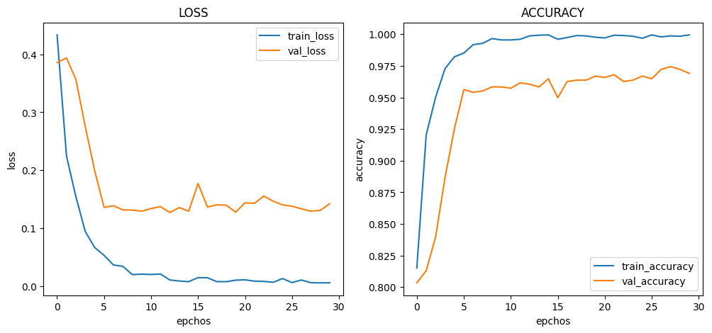

# :pushpin: Kaggle - Chest X-Ray
- Fine-Tuning the InceptionV3 Model Using the 'Chest X-Ray' Dataset

 

## 1. 소스코드(Colab)
- [KaggleProject-Chest X-Ray.ipynb](https://colab.research.google.com/drive/18BXx_fb77k9KbYsv_bVidVf9FhbqK2KA#scrollTo=f2XiUpwDXhNq)

 

## 2. InceptionV3 기본 세팅
- weight: imagenet
- Dropout: 0.5
- optimizer: Adam

 

### 2.1. Basic
- Model Architecture: InceptionV3 - F - D(8)
- Learning Rate: 1e-5

- Train: [loss: 0.0834, acc: 0.9773]
- Validation: [loss: 0.1125, val_acc: 0.9679]
- Test: [loss: 0.1191, acc: 0.9726]
- Learning Time: 0:43:58.176296

 

### 2.2. Change dense value to 16
- Model Architecture: InceptionV3 - F - D(16)
- Learning Rate: 1e-5

- Train: [loss: 0.0172, acc: 0.9965]
- Validation: [loss: 0.1520, val_acc: 0.9647]
- Test: [loss: 0.1304, acc: 0.9726]
- Learning Time: 0:42:56.175761

 

### 2.3. Change dense value to 32
- Model Architecture: InceptionV3 - F - D(32)
- Learning Rate: 1e-5

- Train: [loss: 0.0054, acc: 0.9995]
- Validation: [loss: 0.1420, val_acc: 0.9690]
- Test: [loss: 0.1475, acc: 0.9632]
- Learning Time: 0:42:14.161199

 

### 2.4. Change the number of hidden layers to 2
- Model Architecture: InceptionV3 - F - D(8) - D(8)
- Learning Rate: 1e-5

- Train: [loss: 0.3541, acc: 0.8347]
- Validation: [loss: 0.1579, val_acc: 0.9669]
- Test: [loss: 0.1605, acc: 0.9607]
- Learning Time: 0:54:04.894952

 

### 2.5. Change the number of hidden layers to 3
- Model Architecture: InceptionV3 - F - D(8) - D(8) - D(8)
- Learning Rate: 1e-5

- Train: [loss: 0.4921, acc: 0.6413]
- Validation: [loss: 0.4707, val_acc: 0.7297]
- Test: [loss: 0.4700, acc: 0.7299]
- Learning Time: 0:49:31.292331

 

### 2.6. Change learning rate value to 5e-5
- Model Architecture: InceptionV3 - F - D(8)
- Learning Rate: 5e-5

- Train: [loss: 0.0375, acc: 0.9808]
- Validation: [loss: 0.1004, val_acc: 0.9808]
- Test: [loss: 0.0980, acc: 0.9752]
- Learning Time: 0:40:56.483226

 

### 2.7. Change learning rate value to 1e-4
- Model Architecture: InceptionV3 - F - D(8)
- Learning Rate: 1e-4

- Train: [loss: 0.1020, acc: 0.9603]
- Validation: [loss: 0.4744, val_acc: 0.9327]
- Test: [loss: 0.3179, acc: 0.9470]
- Learning Time: 0:36:49.548395

 

## 3. The result of InceptionV3 fine-tuning

| Model | Hidden Layer | Dense Count | Learning Rate | Accuracy | Learning Time(ms) | 
| :-- | :-: | :-: | :-: | :-: | :-: |
| **mn_resultset1** | 1 | 8 | 1e-5 | 97.26% | 2638176 |
|  |  |  |  |  |  |
| **mn_resultset2** | 1 | **16** | 1e-5 | 97.26% | 2576175 |
| **mn_resultset3** | 1 | **32** | 1e-5 | 96.32% | 2534161 |
|  |  |  |  |  |  |
| **mn_resultset4** | **2** | 8 | 1e-5 | 96.07% | **3244894** |
| **mn_resultset5** | **3** | 8 | 1e-5 | **72.99%** | 2979292 |
|  |  |  |  |  |  |
| **mn_resultset6** | 1 | 8 | **5e-5** | **97.52%** | 2456483 |
| **mn_resultset7** | 1 | 8 | **1e-4** | 94.70% | **2209348** |

 

## 6. 회고 / 느낀점
-

 
