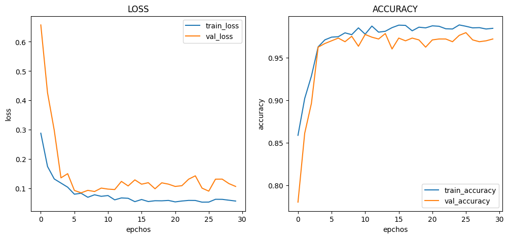
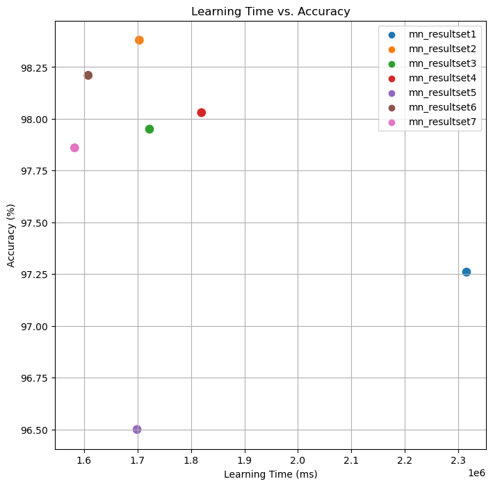

# :pushpin: Kaggle - Chest X-Ray
- Fine-Tuning the MobileNet Model Using the 'Chest X-Rays' Dataset

 

## 1. 소스코드(Colab)
- [KaggleProject-Chest X-Ray.ipynb](https://colab.research.google.com/drive/18BXx_fb77k9KbYsv_bVidVf9FhbqK2KA#scrollTo=f2XiUpwDXhNq)

 

## 2. MobileNet 기본 세팅
- weight: imagenet
- Dropout: 0.5
- optimizer: Adam

 

### 2.1. Basic
- Model Architecture: MobileNet - F - D(8)
- Learning Rate: 1e-5

- Train: [loss: 0.0648, acc: 0.9699]
- Validation: [loss: 0.0793, val_acc: 0.9754]
- Test: [loss: 0.0854, acc: 0.9726]
- Learning Time: 0:38:35.143337

 

### 2.2. Change dense value to 16
- Model Architecture: MobileNet - F - D(16)
- Learning Rate: 1e-5

- Train: [loss: 0.0298, acc: 0.9867]
- Validation: [loss: 0.0945, val_acc: 0.9754]
- Test: [loss: 0.0652, acc: 0.9838]
- Learning Time: 0:28:23.514364

 

### 2.3. Change dense value to 32
- Model Architecture: MobileNet - F - D(32)
- Learning Rate: 1e-5

- Train: [loss: 0.0126, acc: 0.9968]
- Validation: [loss: 0.0992, val_acc: 0.9712]
- Test: [loss: 0.0774, acc: 0.9795]
- Learning Time: 0:28:42.609628

 

### 2.4. Change the number of hidden layers to 2
- Model Architecture: MobileNet - F - D(8) - D(8)
- Learning Rate: 1e-5

- Train: [loss: 0.4389, acc: 0.9040]
- Validation: [loss: 0.1930, val_acc: 0.9658]
- Test: [loss: 0.1761, acc: 0.9803]
- Learning Time: 0:30:19.743447

 

### 2.5. Change the number of hidden layers to 3
- Model Architecture: MobileNet - F - D(8) - D(8) - D(8)
- Learning Rate: 1e-5

- Train: [loss: 0.5294, acc: 0.7480]
- Validation: [loss: 0.3263, val_acc: 0.9444]
- Test: [loss: 0.3138, acc: 0.9650]
- Learning Time: 0:28:12.711821

 

### 2.6. Change learning rate value to 5e-5
- Model Architecture: MobileNet - F - D(8)
- Learning Rate: 5e-5

- Train: [loss: 0.0573, acc: 0.9848]
- Validation: [loss: 0.1070, val_acc: 0.9722]
- Test: [loss: 0.0864, acc: 0.9821]
- Learning Time: 0:26:47.903135

 

### 2.7. Change learning rate value to 1e-4
- Model Architecture: MobileNet - F - D(8)
- Learning Rate: 1e-4

- Train: [loss: 0.0997, acc: 0.9893]
- Validation: [loss: 0.1916, val_acc: 0.9712]
- Test: [loss: 0.1152, acc: 0.9786]
- Learning Time: 0:26:22.636220

 

## 3. The result of MobileNet fine-tuning

| Model | Hidden Layer | Dense Count | Learning Rate | Accuracy | Learning Time(ms) | 
| :-- | :-: | :-: | :-: | :-: | :-: |
| **mn_resultset1** | 1 | 8 | 1e-5 | 97.26% | **2315143** |
|  |  |  |  |  |  |
| **mn_resultset2** | 1 | **16** | 1e-5 | **98.38%** | 1703514 |
| **mn_resultset3** | 1 | **32** | 1e-5 | 97.95% | 1722609 |
|  |  |  |  |  |  |
| **mn_resultset4** | **2** | 8 | 1e-5 | 98.03% | 1819743 |
| **mn_resultset5** | **3** | 8 | 1e-5 | **96.50%** | 1699331 |
|  |  |  |  |  |  |
| **mn_resultset6** | 1 | 8 | **5e-5** | 98.21% | 1607903 |
| **mn_resultset7** | 1 | 8 | **1e-4** | 97.86% | **1582636** |

 

## 6. 회고 / 느낀점
>Hidden Layer: 
	- Hidden Layer의 증가에 따른 경향성을 파악 할 수 없었습니다. 
	- Hidden Layer를 2개로 설정한 mn_resultset4에서는 정확도가 유지되는 것을 확인할 수 있습니다. 
	- Hidden Layer의 수를 늘릴 경우, 모델의 표현력을 증가시키는 대신에 적절한 균형을 유지해야 합니다. 
	- Hidden Layer를 3개로 설정한 mn_resultset5에서는 정확도가 낮아진 것을 볼 수 있습니다. 
	- Hidden Layer의 수를 증가시킴으로써 모델의 표현력을 높였지만, 일부 데이터에 대해 과적합의 가능성이 증가했을 수 있습니다. 
>Dense Count: 
	- Dense Count의 증가에 따른 경향성을 파악 할 수 없었습니다. 
	- mn_resultset2와 mn_resultset3에서 Dense Count를 16과 32로 증가시킨 경우에도 높은 정확도를 유지하는 것을 볼 수 있습니다. 
	- 모델의 표현력을 높일 수 있는 방법 중 하나는 Dense Count를 증가시키는 것입니다. 
>Learning Rate: 
	- Learning Rate의 증가에 따른 경향성을 파악 할 수 없었습니다. 
	- mn_resultset6와 mn_resultset7에서 Learning Rate를 증가시킨 경우에도 정확도가 높은 수준을 유지하는 것을 볼 수 있습니다. 
	- 학습 속도를 조정하여 모델의 성능을 개선한 것으로 보입니다. 
>Conculusion: 
	- mn_resultset2의 Hidden Layer를 1개, Dense Count를 16로 설정하고 Learning Rate를 1e-5로 설정한 경우가 가장 높은 정확도를 보였습니다. 

 
