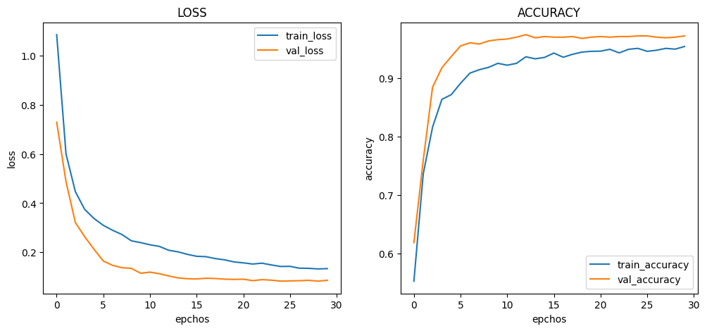
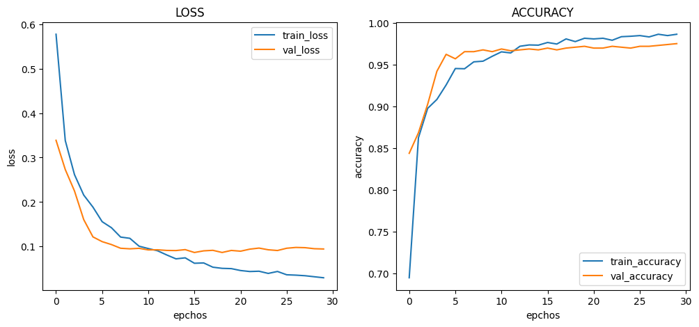
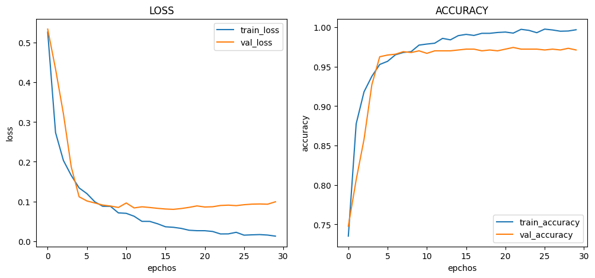
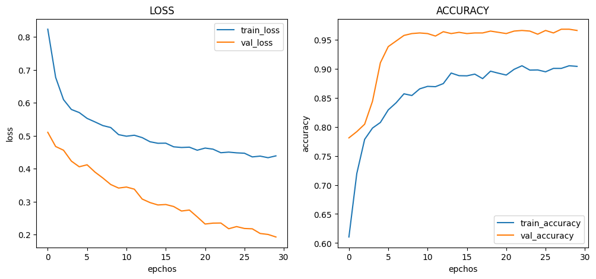
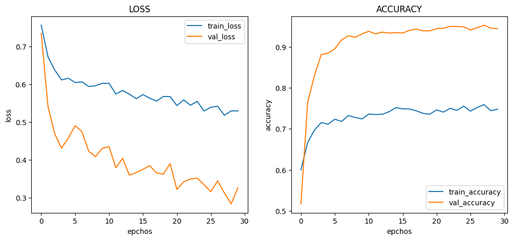
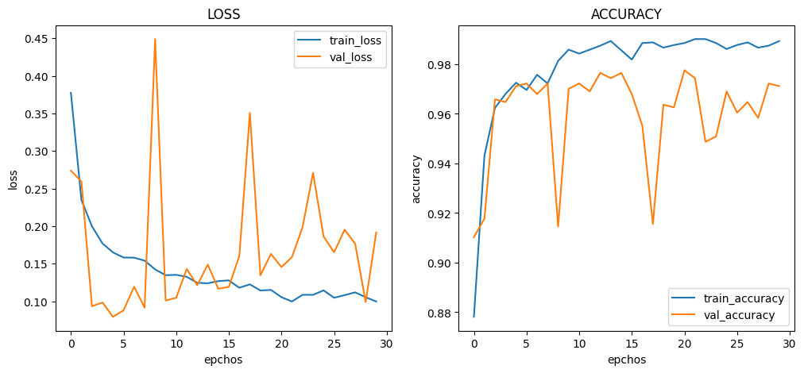
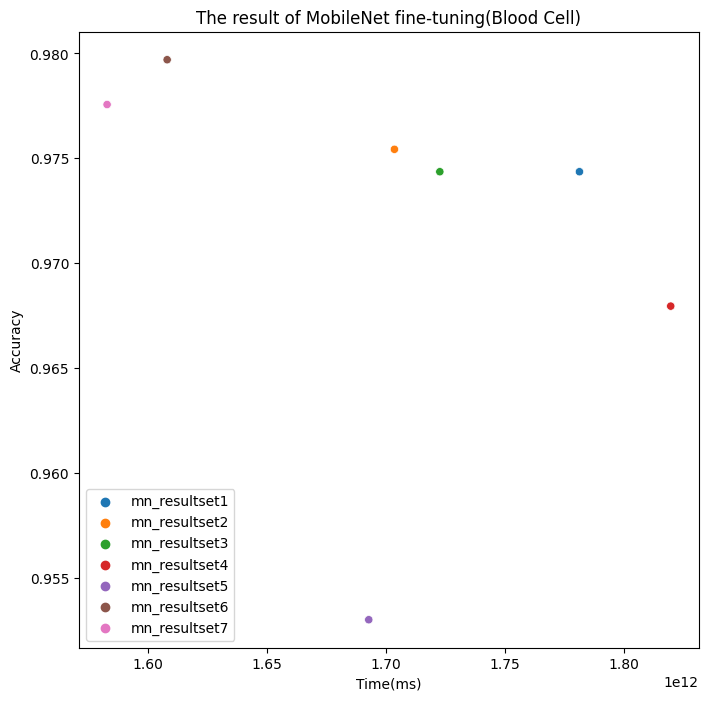

# :pushpin: Kaggle - Chest X-Ray
- Fine-Tuning the MobileNet Model Using the 'Chest X-Ray' Dataset

 

## 1. 소스코드(Colab)
- [KagglePoject-Chest X-Ray Images (Pneumonia).ipynb](https://colab.research.google.com/drive/11vze7G2OSFKjTTldVgSjXBv_S2GLsqGv)

 

## 2. MobileNet 기본 세팅
- weight: imagenet
- Dropout: 0.5
- optimizer: Adam

 

### 2.1. Basic
- Model Architecture: MobileNet - F - D(8)
- Learning Rate: 1e-5

- Train : [loss: 0.0648, acc: 0.9699]
- Validation : [loss: 0.0793, val_acc: 0.9754]
- Test : [loss: 0.0854, acc: 0.9726]
- Learning Time : 0:38:35.143337

 

### 2.2. Change dense value to 16
- Model Architecture: MobileNet - F - D(16)
- Learning Rate: 1e-5

- Train : [loss: 0.0298, acc: 0.9867]
- Validation : [loss: 0.0652 , val_acc: 0.9838]
- Learning Time : 0:28:23.514364

 

### 2.3. Change dense value to 32
- Model Architecture: MobileNet - F - D(32)
- Learning Rate: 1e-5

- Train : [loss: 0.0126, acc: 0.9968]
- Validation : [loss: 0.0992, val_acc: 0.9712]
- Test : [loss: 0.0774 - acc: 0.9795]
- Learning Time :  0:28:42.609628

 

### 2.4. Change the number of hidden layers to 2
- Model Architecture: MobileNet - F - D(8) - D(8)
- Learning Rate: 1e-5

- Train : [loss: 0.4389, acc: 0.9040]
- Validation : [loss: 0.1930, val_acc: 0.9658]
- Test : [loss: 0.1761 - acc: 0.9803]
- Learning Time :  0:30:19.743447

 

### 2.5. Change the number of hidden layers to 3
- Model Architecture: MobileNet - F - D(8) - D(8) - D(8)
- Learning Rate: 1e-5

- Train : [loss: 0.5294, acc: 0.7480]
- Validation : [loss: 0.3263, val_acc: 0.9444]
- Test : [loss: 0.3138 - acc: 0.9650]
- Learning Time :  0:28:12.711821

 

### 2.6. Change learning rate value to 5e-5
- Model Architecture: MobileNet - F - D(8)
- Learning Rate: 5e-5

- Train : [loss: 0.0573, acc: 0.9848]
- Validation : [loss: 0.1070, val_acc: 0.9722]
- Test : [loss: 0.0864 - acc: 0.9821]
- Learning Time :  0:26:47.903135

 

### 2.7. Change learning rate value to 1e-4
- Model Architecture: MobileNet - F - D(8)
- Learning Rate: 1e-4

- Train : [loss: 0.0997, acc: 0.9893]
- Validation : [loss: 0.1916, val_acc: 0.9712]
- Test : [loss: 0.1152 - acc: 0.9786]
- Learning Time :  0:26:22.636220

 

## 3. The result of MobileNet fine-tuning

| Model | Hidden Layer | Dense Count | Learning Rate | Accuracy | Learning Time(ms) | 
| :-- | :-: | :-: | :-: | :-: | :-: |
| **mn_resultset1** | 1 | 8 | 1e-5 | 97.26% | **2315143.337** |
|  |  |  |  |  |  |
| **mn_resultset2** | 1 | **16** | 1e-5 | **98.38%** | 1703514.364 |
| **mn_resultset3** | 1 | **32** | 1e-5 | 96.50% | 1722609.628 |
|  |  |  |  |  |  |
| **mn_resultset4** | **2** | 8 | 1e-5 | 98.03% | 1819743.447 |
| **mn_resultset5** | **3** | 8 | 1e-5 | **96.50%** | 1692711.821 |
|  |  |  |  |  |  |
| **mn_resultset6** | 1 | 8 | **5e-5** | 98.21% | 1607903.135 |
| **mn_resultset7** | 1 | 8 | **1e-4** | 97.86% | **1582636.220** |

 

## 4. Reflection

- 히든 레이어와 정확도
	- 실험 결과에 따르면, 히든 레이어의 수와 정확도는 영향이 없는 것으로 나타났습니다.
	- 히든레이어가 2개인 모델은 베이스 모델보다 정확도가 상대적으로 높았습니다. 
	- 그러나 히든레이어가 4개인 모델은 베이스 모델보다 정확도가 상대적으로 낮았습니다.
	- 이는 적절한 히든레이어 수를 선택하는 것이 모델의 성능을 최적화하는 데 중요하다는 것을 시사합니다.
	
- 덴스 수 증가와 정확도
	- 실험 결과를 분석한 결과, 덴스 수와 정확도는 영향이 없는 것으로 나타났습니다.
	- 덴스 수가 16인 모델은 베이스 모델보다 정확도가 상대적으로 높았습니다.
	- 그러나 덴스 수가 32인 모델은 베이스 모델보다 정확도가 상대적으로 낮았습니다.
	- 이는 적절한 덴스 수를 선택하는 것이 모델의 성능을 최적화하는 데 중요하다는 것을 시사합니다.

- 러닝 레이트와 정확도
	- 실험 결과에 따르면, 러닝레이트가 증가 할수록 정확도가 높아지는 경향이 있는 것으로 나타났습니다.
	- 러닝 레이트가 2e-5인 모델은 높은 학습률로 학습되어 상대적으로 높은 정확도를 달성했습니다. 
	- 그러나 러닝 레이트가 1e-4인 모델은 러닝 레이트가 2e-5인 모델보다 상대적으로 정확도가 낮아졌습니다. 
	- 이는 적절한 덴스 수를 선택하는 것이 모델의 성능을 최적화하는 데 중요하다는 것을 시사합니다.
	
 
