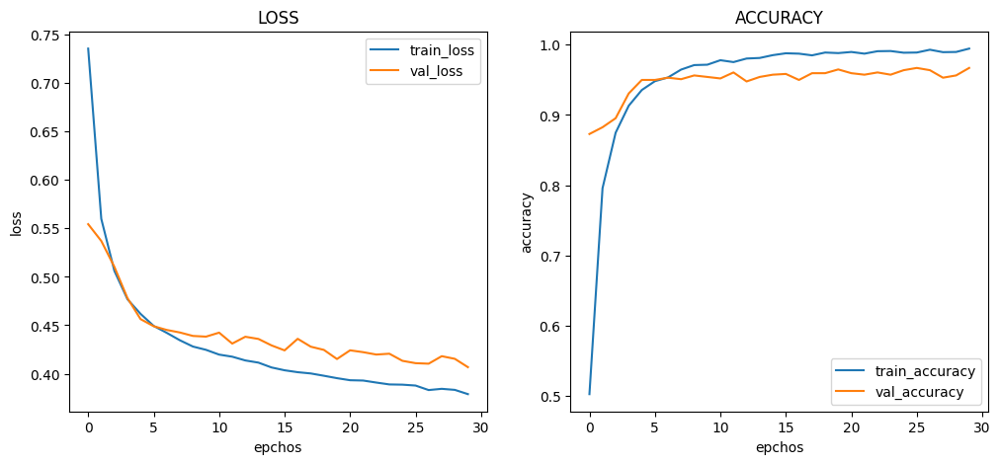

# :pushpin: Kaggle - Chest X-Ray Images (Pneumonia)
- CNN 모델별(MobileNet, InceptionV3, Xception, ResNet50, VGG16) Chest X-Ray Images (Pneumonia) 데이터 분석 성능 비교

 

## 1. 제작 기간 & 참여 인원
- 2023.00.00 ~ 2023.00.00
- 개인 프로젝트

 

## 2. 사용 라이브러리(Python)
  - 

 

## 3. 소스코드(Colab)
[KaggleProject-Blood Cell.ipynb](https://colab.research.google.com/drive/11vze7G2OSFKjTTldVgSjXBv_S2GLsqGv#scrollTo=UN3anGcRXBCX)

 

## 4. 모델 별 loss, acc 그래프 확인
- 기본 아키텍처 : pre_trained_model - F - D - D
- weight : imagenet
- 노드 수 : 16
- Dropout : 0.5
- optimizer : Adam(1e-5)

 

### 4.1. MobileNet

- Train : [loss: 0.5690, acc: 0.9813]
- Validation : [loss: 0.5734, val_acc: 0.9712]
- Test : [loss: 0.5749 - acc: 0.9692]
- Learning Time :  0:33:44.058732

 

### 4.2. InceptionV3

- Train : [loss: 0.3789, acc: 0.9944]
- Validation : [loss: 0.4068, val_acc: 0.9669]
- Test : [loss: 0.4074 - acc: 0.9632]
- Learning Time :  0:36:07.468925

 

### 4.3. Xception

- Train : [loss: 0.3558, acc: 0.9909]
- Validation : [loss: 0.3773, val_acc: 0.9658]
- Test : [loss: 0.3791 - acc: 0.9641]
Learning Time :  0:41:51.795174

 

### 4.4. ResNet50

- Train : [loss: 0.3706, acc: 0.9939]
- Validation : [loss: 0.3799, val_acc: 0.9797]
- Test : [loss: 0.3826 - acc: 0.9769]
Learning Time :  0:38:43.774339

 

### 4.5. VGG16

- Train : [loss: 0.4479, acc: 0.9301]
- Validation : [loss: 0.4453, val_acc: 0.9615]
- Test : [loss: 0.4426 - acc: 0.9675]
Learning Time :  0:36:44.323282

 

## 5. 모델 별 학습시간, 정확도 그래프
- x : 학습시간
- y : 정확도
- label : [train, validation, test]

 

## 6. 회고 / 느낀점
-

 
