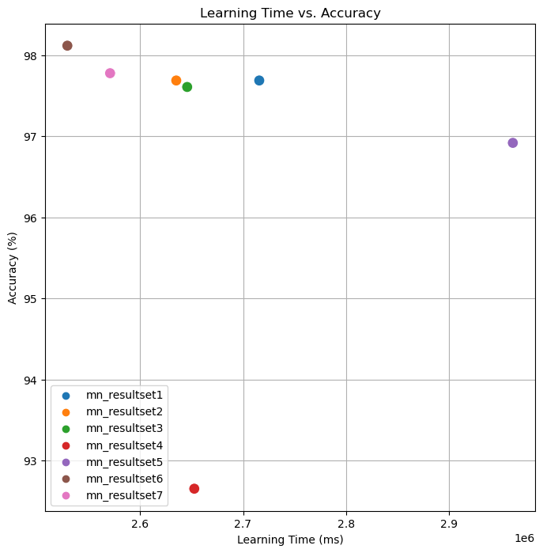

# :pushpin: Kaggle - Chest X-Ray
- Fine-Tuning the ResNet50 Model Using the 'Chest X-Rays' Dataset

 

## 1. 소스코드(Colab)
- [KaggleProject-Chest X-Ray.ipynb](https://colab.research.google.com/drive/18BXx_fb77k9KbYsv_bVidVf9FhbqK2KA#scrollTo=f2XiUpwDXhNq)

 

## 2. ResNet50 기본 세팅
- weight: imagenet
- Dropout: 0.5
- optimizer: Adam

 

### 2.1. Basic
- Model Architecture: ResNet50 - F - D(8)
- Learning Rate: 1e-5

- Train: [loss: 0.1291, acc: 0.9955]
- Validation: [loss: 0.0703, val_acc: 0.9744]
- Test: [loss: 0.0984, acc: 0.9769]
- Learning Time: 0:45:15.677119

 

### 2.2. Change dense value to 16
- Model Architecture: ResNet50 - F - D(16)
- Learning Rate: 1e-5

- Train: [loss: 0.0088, acc: 0.9995]
- Validation: [loss: 0.1038, val_acc: 0.9797]
- Test: [loss: 0.1264, acc: 0.9769]
- Learning Time: 0:43:55.198377

 

### 2.3. Change dense value to 32
- Model Architecture: ResNet50 - F - D(32)
- Learning Rate: 1e-5

- Train: [loss: 0.0048, acc: 0.9992]
- Validation: [loss: 0.1019, val_acc: 0.9808]
- Test: [loss: 0.0983, acc: 0.9761]
- Learning Time: 0:44:05.800716

 

### 2.4. Change the number of hidden layers to 2
- Model Architecture: ResNet50 - F - D(8) - D(8)
- Learning Rate: 1e-5

- Train: [loss: 0.2476, acc: 0.8429]
- Validation: [loss: 0.2938, val_acc: 0.9177]
- Test: [loss: 0.2977, acc: 0.9265]
- Learning Time: 0:44:12.687518

 

### 2.5. Change the number of hidden layers to 3
- Model Architecture: ResNet50 - F - D(8) - D(8) - D(8)
- Learning Rate: 1e-5

- Train: [loss: 0.4830, acc: 0.8461]
- Validation: [loss: 0.2115, val_acc: 0.9722]
- Test: [loss: 0.2137, acc: 0.9692]
- Learning Time: 0:49:21.592140

 

### 2.6. Change learning rate value to 5e-5
- Model Architecture: ResNet50 - F - D(8)
- Learning Rate: 5e-5

- Train: [loss: 0.1127, acc: 0.9949]
- Validation: [loss: 0.0438, val_acc: 0.9882]
- Test: [loss: 0.0754, acc: 0.9812]
- Learning Time: 0:42:09.593870

 

### 2.7. Change learning rate value to 1e-4
- Model Architecture: ResNet50 - F - D(8)
- Learning Rate: 1e-4

- Train: [loss: 0.0475, acc: 0.9875]
- Validation: [loss: 0.1228, val_acc: 0.9840]
- Test: [loss: 0.1584, acc: 0.9778]
- Learning Time: 0:42:51.028279

 

## 3. The result of ResNet50 fine-tuning

| Model | Hidden Layer | Dense Count | Learning Rate | Accuracy | Learning Time(ms) | 
| :-- | :-: | :-: | :-: | :-: | :-: |
| **mn_resultset1** | 1 | 8 | 1e-5 | 97.69% | 2715677 |
|  |  |  |  |  |  |
| **mn_resultset2** | 1 | **16** | 1e-5 | 97.69%% | 2635198 |
| **mn_resultset3** | 1 | **32** | 1e-5 | 97.61% | 2645800 |
|  |  |  |  |  |  |
| **mn_resultset4** | **2** | 8 | 1e-5 | **92.65%** | 2652687 |
| **mn_resultset5** | **3** | 8 | 1e-5 | 96.92% | **2961592** |
|  |  |  |  |  |  |
| **mn_resultset6** | 1 | 8 | **5e-5** | **98.12%** | **2529593** |
| **mn_resultset7** | 1 | 8 | **1e-4** | 97.78% | 2571028 |

 

## 6. 회고 / 느낀점
-

 
