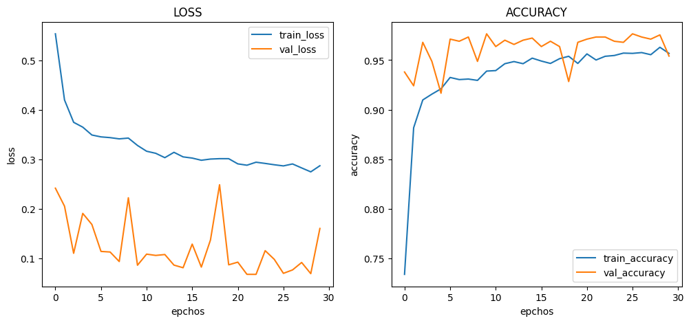
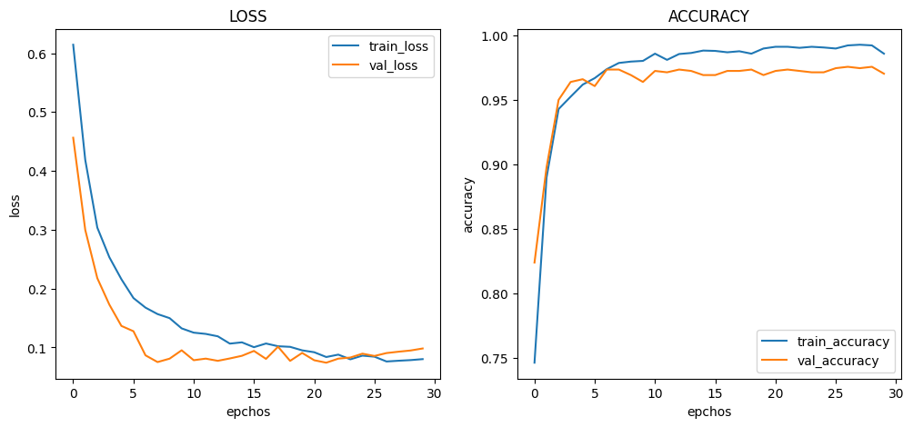
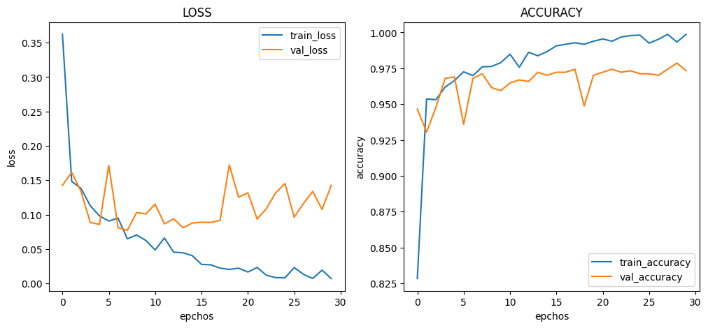
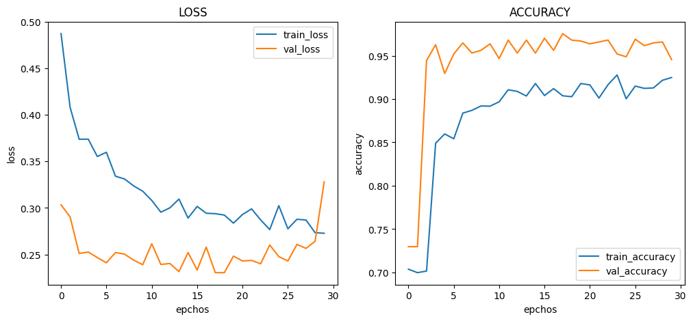
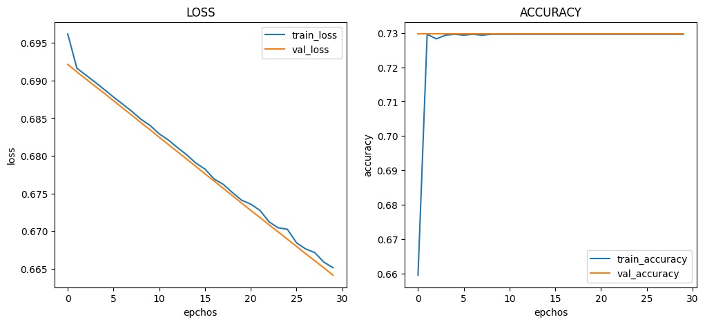
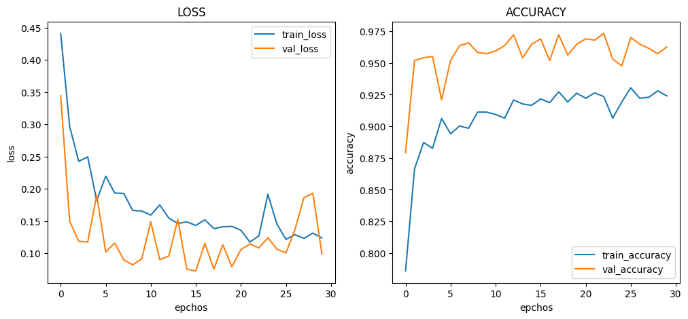
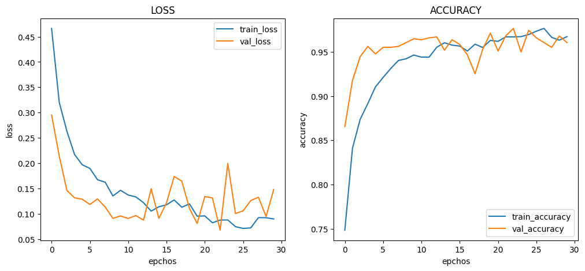
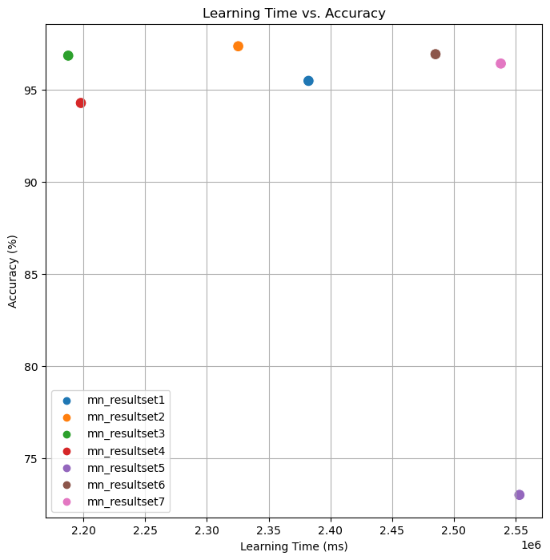

# :pushpin: Kaggle - Chest X-Ray
- Fine-Tuning the VGG16 Model Using the 'Chest X-Rays' Dataset

 

## 1. 소스코드(Colab)
- [KaggleProject-Chest X-Ray.ipynb](https://colab.research.google.com/drive/18BXx_fb77k9KbYsv_bVidVf9FhbqK2KA#scrollTo=f2XiUpwDXhNq)

 

## 2. VGG16 기본 세팅
- weight: imagenet
- Dropout: 0.5
- optimizer: Adam

 

### 2.1. Basic
- Model Architecture: VGG16 - F - D(8)
- Learning Rate: 1e-5

- Train: [loss: 0.2867, acc: 0.9568]
- Validation: [loss: 0.1598, val_acc: 0.9541]
- Test: [loss: 0.1809, acc: 0.9547]
- Learning Time: 0:39:42.261887

 

### 2.2. Change dense value to 16
- Model Architecture: VGG16 - F - D(16)
- Learning Rate: 1e-5

- Train: [loss: 0.0243, acc: 0.9907]
- Validation: [loss: 0.1040, val_acc: 0.9754]
- Test: [loss: 0.1024, acc: 0.9735]
- Learning Time: 0:38:45.366013

 

### 2.3. Change dense value to 32
- Model Architecture: VGG16 - F - D(32)
- Learning Rate: 1e-5

- Train: [loss: 0.0070, acc: 0.9987]
- Validation: [loss: 0.1427, val_acc: 0.9733]
- Test: [loss: 0.1663, acc: 0.9684]
- Learning Time: 0:36:27.702989

 

### 2.4. Change the number of hidden layers to 2
- Model Architecture: VGG16 - F - D(8) - D(8)
- Learning Rate: 1e-5

- Train: [loss: 0.2728, acc: 0.9248]
- Validation: [loss: 0.3280, val_acc: 0.9455]
- Test: [loss: 0.3162, acc: 0.9427]
- Learning Time: 0:36:37.948047

 

### 2.5. Change the number of hidden layers to 3
- Model Architecture: VGG16 - F - D(8) - D(8) - D(8)
- Learning Rate: 1e-5

- Train: [loss: 0.6651, acc: 0.7296]
- Validation: [loss: 0.6641, val_acc: 0.7297]
- Test: [loss: 0.6641, acc: 0.7299]
- Learning Time: 0:42:33.070189

 

### 2.6. Change learning rate value to 5e-5
- Model Architecture: VGG16 - F - D(8)
- Learning Rate: 5e-5

- Train: [loss: 0.1234, acc: 0.9240]
- Validation: [loss: 0.0985, val_acc: 0.9626]
- Test: [loss: 0.1121, acc: 0.9692]
- Learning Time: 0:41:25.094588

 

### 2.7. Change learning rate value to 1e-4
- Model Architecture: VGG16 - F - D(8)
- Learning Rate: 1e-4

- Train: [loss: 0.0899, acc: 0.9672]
- Validation: [loss: 0.1482, val_acc: 0.9605]
- Test: [loss: 0.1362, acc: 0.9641]
- Learning Time: 0:42:17.984156

 

## 3. The result of VGG16 fine-tuning

| Model | Hidden Layer | Dense Count | Learning Rate | Accuracy | Learning Time(ms) | 
| :-- | :-: | :-: | :-: | :-: | :-: |
| **mn_resultset1** | 1 | 8 | 1e-5 | 95.47% | 2382261 |
|  |  |  |  |  |  |
| **mn_resultset2** | 1 | **16** | 1e-5 | **97.35%** | 2325366 |
| **mn_resultset3** | 1 | **32** | 1e-5 | 96.84% | **2187702** |
|  |  |  |  |  |  |
| **mn_resultset4** | **2** | 8 | 1e-5 | 94.27% | 2197948 |
| **mn_resultset5** | **3** | 8 | 1e-5 | **72.99%** | **2553070** |
|  |  |  |  |  |  |
| **mn_resultset6** | 1 | 8 | **5e-5** | 96.92% | 2485094 |
| **mn_resultset7** | 1 | 8 | **1e-4** | 96.41% | 2537984 |

 

## 6. 회고 / 느낀점
>Hidden Layer: 
	- Hidden Layer의 증가에 따라 정확도가 감소하는 경향성을 확인 하였습니다. 
	- Hidden Layer를 2개로 설정한 mn_resultset4에서는 정확도가 낮아진 것을 볼 수 있습니다. 
	- Hidden Layer의 수를 늘리면 모델의 복잡성이 증가하여 과적합의 위험이 커질 수 있습니다. 
	- Hidden Layer를 3개로 설정한 mn_resultset5에서는 낮은 정확도를 보여줍니다.  
	- Hidden Layer의 수를 증가시킴으로써 모델의 표현력이 증가하지만, 데이터셋에 대한 학습이 제대로 이루어지지 않았을 수 있습니다. 
>Dense Count: 
	- Dense Count의 증가에 따른 경향성을 파악 할 수 없었습니다. 
	- mn_resultset2와 mn_resultset3에서 Dense Count를 16과 32로 증가시킨 경우에는 높은 정확도를 보여줍니다. 
	- Dense Count를 증가시킴으로써 모델의 표현력이 증가했을 것으로 예상됩니다. 
>Learning Rate: 
	- Learning Rate의 증가에 따른 경향성을 파악 할 수 없었습니다. 
	- mn_resultset5에서 Learning Rate를 1e-5로 설정한 경우에도 정확도가 낮지만, 학습 시간이 길어지는 단점을 가지고 있습니다. 
	- 적절한 학습 속도를 선택하여 모델의 성능을 개선해야 합니다. 
>Conculusion: 
	- mn_resultset2의 Hidden Layer를 1개, Dense Count를 16로 설정하고 Learning Rate를 1e-5로 설정한 경우가 가장 높은 정확도를 보였습니다. 

 
