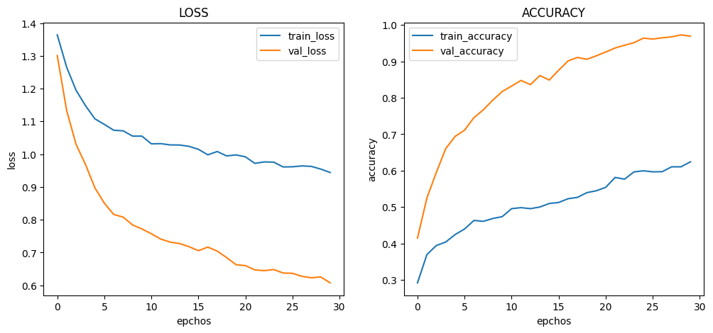
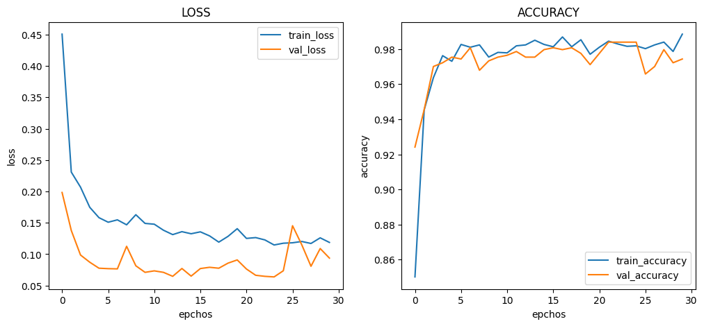
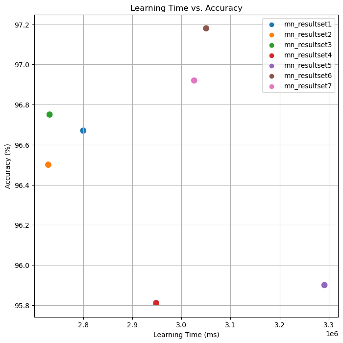

# :pushpin: Kaggle - Chest X-Ray
- Fine-Tuning the Xception Model Using the 'Chest X-Ray' Dataset

 

## 1. 소스코드(Colab)
- [KaggleProject-Chest X-Ray.ipynb](https://colab.research.google.com/drive/18BXx_fb77k9KbYsv_bVidVf9FhbqK2KA#scrollTo=f2XiUpwDXhNq)

 

## 2. Xception 기본 세팅
- weight: imagenet
- Dropout: 0.5
- optimizer: Adam

 

### 2.1. Basic
- Model Architecture: Xception - F - D(8)
- Learning Rate: 1e-5

-Train: [loss: 0.0525, acc: 0.9627]
-Validation: [loss: 0.0994, val_acc: 0.9701]
-Test: [loss: 0.1454, acc: 0.9667]
-Learning Time: 0:46:39.773500

 

### 2.2. Change dense value to 16
- Model Architecture: Xception - F - D(16)
- Learning Rate: 1e-5

-Train: [loss: 0.0128, acc: 0.9987]
-Validation: [loss: 0.0996, val_acc: 0.9733]
-Test: [loss: 0.1832, acc: 0.9650]
-Learning Time: 0:45:28.518346

 

### 2.3. Change dense value to 32
- Model Architecture: Xception - F - D(32)
- Learning Rate: 1e-5

-Train: [loss: 0.0071, acc: 0.9987]
-Validation: [loss: 0.0855, val_acc: 0.9765]
-Test: [loss: 0.1677, acc: 0.9675]
-Learning Time: 0:45:31.250777

 

### 2.4. Change the number of hidden layers to 2
- Model Architecture: Xception - F - D(8) - D(8)
- Learning Rate: 1e-5

-Train: [loss: 0.2962, acc: 0.9096]
-Validation: [loss: 0.2271, val_acc: 0.9712]
-Test: [loss: 0.2450, acc: 0.9581]
-Learning Time: 0:49:08.442575

 

### 2.5. Change the number of hidden layers to 3
- Model Architecture: Xception - F - D(8) - D(8) - D(8)
- Learning Rate: 1e-5

-Train: [loss: 0.5484, acc: 0.7397]
-Validation: [loss: 0.3992, val_acc: 0.9573]
-Test: [loss: 0.3989, acc: 0.9590]
-Learning Time: 0:54:51.391264

 

### 2.6. Change learning rate value to 5e-5
- Model Architecture: Xception - F - D(8)
- Learning Rate: 5e-5

-Train: [loss: 0.1187, acc: 0.9885]
-Validation: [loss: 0.0938, val_acc: 0.9744]
-Test: [loss: 0.1277, acc: 0.9718]
-Learning Time: 0:50:50.284919

 

### 2.7. Change learning rate value to 1e-4
- Model Architecture: Xception - F - D(8)
- Learning Rate: 1e-4

-Train: [loss: 0.0565, acc: 0.9859]
-Validation: [loss: 0.1144, val_acc: 0.9797]
-Test: [loss: 0.1476, acc: 0.9692]
-Learning Time: 0:50:25.817765

 

## 3. The result of Xception fine-tuning

| Model | Hidden Layer | Dense Count | Learning Rate | Accuracy | Learning Time(ms) | 
| :-- | :-: | :-: | :-: | :-: | :-: |
| **mn_resultset1** | 1 | 8 | 1e-5 | 96.67% | 2799773 |
|  |  |  |  |  |  |
| **mn_resultset2** | 1 | **16** | 1e-5 | 96.50% | **2728518** |
| **mn_resultset3** | 1 | **32** | 1e-5 | 96.75% | 2731250 |
|  |  |  |  |  |  |
| **mn_resultset4** | **2** | 8 | 1e-5 | **95.81%** | 2948442 |
| **mn_resultset5** | **3** | 8 | 1e-5 | 95.90% | **3291391** |
|  |  |  |  |  |  |
| **mn_resultset6** | 1 | 8 | **5e-5** | **97.18%** | 3050284 |
| **mn_resultset7** | 1 | 8 | **1e-4** | 96.92% | 3025817 |

 

## 6. 회고 / 느낀점
-

 
